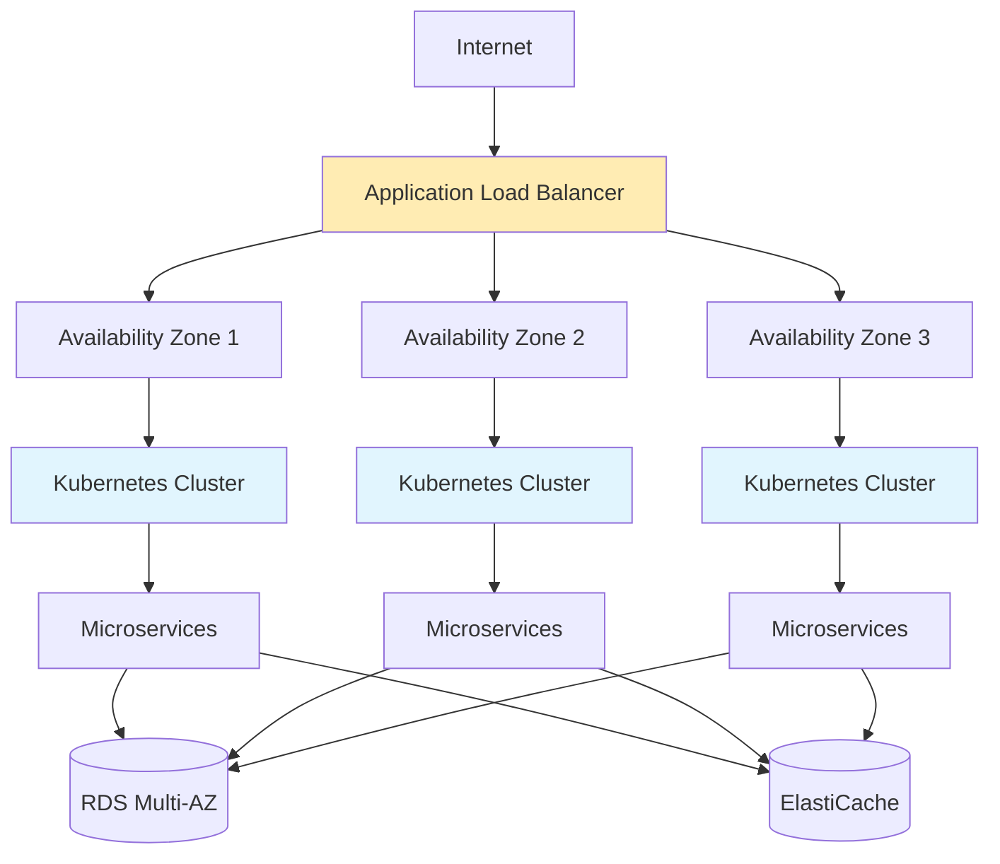
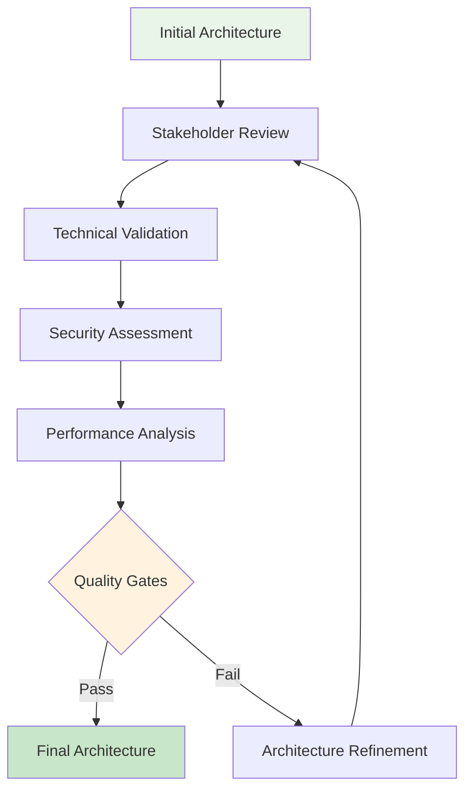

# Architecture Agent

The **Architecture Agent** is a specialized AI system that excels at **system design and architecture** - transforming validated requirements into comprehensive, scalable, and maintainable software architectures that align with industry best practices and organizational constraints.

## 🏗️ Agent Overview

### **Core Mission**
Design robust, scalable software architectures that optimize for performance, maintainability, security, and business objectives while ensuring technical feasibility and implementation efficiency.

### **Key Capabilities**
- **System Architecture Design**: Create comprehensive system blueprints and component structures
- **Pattern Application**: Apply proven architectural patterns and design principles
- **Technology Selection**: Recommend optimal technology stacks and frameworks
- **Scalability Planning**: Design for current and future scale requirements
- **Security Architecture**: Integrate security considerations at the architectural level
- **Performance Optimization**: Design for optimal performance and resource utilization

## 📋 Input Processing

### **Primary Inputs**

**Requirements Artifacts**
- Validated functional and non-functional requirements
- Business rules and constraints
- User stories and use cases
- Performance and scalability targets
- Security and compliance requirements

**Technical Context**
- Existing system architecture (for modernization)
- Technology stack preferences and constraints
- Infrastructure limitations and capabilities
- Integration requirements and external dependencies
- Organizational technology standards

**Business Context**
- Budget and timeline constraints
- Team size and skill levels
- Maintenance and operational considerations
- Future roadmap and evolution plans

### **Context Integration**

```yaml
# Architecture context configuration
context_sources:
  requirements:
    - requirements.yaml
    - business_rules.yaml
    - performance_targets.yaml
  
  technical:
    - technology_standards.md
    - infrastructure_constraints.yaml
    - integration_specifications.yaml
  
  organizational:
    - team_capabilities.yaml
    - operational_procedures.md
    - compliance_requirements.yaml
```

## 🏢 Output Deliverables

### **Architecture Specification**

```yaml
# architecture.yaml - Comprehensive architecture specification
architecture:
  project_info:
    name: "E-commerce Platform"
    version: "2.0.0"
    architect: "architecture_agent"
    created: "2024-01-15"
    last_updated: "2024-01-15"
  
  architecture_style:
    primary: "microservices"
    patterns: ["event_driven", "cqrs", "hexagonal"]
    principles: ["separation_of_concerns", "single_responsibility", "dependency_inversion"]
  
  system_overview:
    description: "Scalable e-commerce platform with microservices architecture"
    core_capabilities:
      - "User management and authentication"
      - "Product catalog and inventory"
      - "Order processing and fulfillment"
      - "Payment processing"
      - "Notification system"
    
    quality_attributes:
      performance:
        response_time: "< 200ms for 95% of requests"
        throughput: "10,000 requests per second"
        availability: "99.9% uptime"
      
      scalability:
        horizontal_scaling: "auto-scaling based on load"
        data_scaling: "database sharding and replication"
        geographic_scaling: "multi-region deployment"
      
      security:
        authentication: "OAuth 2.0 / JWT"
        authorization: "RBAC with fine-grained permissions"
        data_protection: "Encryption at rest and in transit"

components:
  services:
    - name: "user-service"
      description: "User management and authentication"
      type: "microservice"
      technology_stack:
        runtime: "Node.js"
        framework: "Express.js"
        database: "PostgreSQL"
        cache: "Redis"
      
      interfaces:
        rest_api:
          base_url: "/api/v1/users"
          endpoints:
            - method: "POST"
              path: "/register"
              description: "User registration"
            - method: "POST"
              path: "/login"
              description: "User authentication"
            - method: "GET"
              path: "/{userId}"
              description: "Get user profile"
      
      events:
        publishes:
          - "user.registered"
          - "user.updated"
          - "user.deleted"
        subscribes:
          - "order.completed"
      
      dependencies:
        internal: []
        external: ["email-service", "identity-provider"]
      
      data_model:
        entities:
          - name: "User"
            attributes: ["id", "email", "password_hash", "profile", "created_at"]
            relationships:
              - type: "one_to_many"
                target: "UserSession"
      
      scalability:
        horizontal_scaling: true
        load_balancing: "round_robin"
        caching_strategy: "user_profile_cache"
      
      security:
        authentication_required: true
        rate_limiting: "100 requests per minute"
        input_validation: "strict"
    
    - name: "product-service"
      description: "Product catalog and inventory management"
      type: "microservice"
      technology_stack:
        runtime: "Java"
        framework: "Spring Boot"
        database: "PostgreSQL"
        search_engine: "Elasticsearch"
      
      interfaces:
        rest_api:
          base_url: "/api/v1/products"
          endpoints:
            - method: "GET"
              path: "/"
              description: "Search and list products"
            - method: "GET"
              path: "/{productId}"
              description: "Get product details"
            - method: "PUT"
              path: "/{productId}/inventory"
              description: "Update inventory levels"
      
      events:
        publishes:
          - "product.created"
          - "product.updated"
          - "inventory.updated"
        subscribes:
          - "order.item_reserved"
          - "order.item_released"
      
      scalability:
        read_replicas: 3
        caching_strategy: "product_catalog_cache"
        search_optimization: "elasticsearch_indexing"

data_architecture:
  strategy: "database_per_service"
  consistency_model: "eventual_consistency"
  
  databases:
    - name: "user-db"
      type: "PostgreSQL"
      purpose: "User data and sessions"
      backup_strategy: "daily_backups"
      
    - name: "product-db"
      type: "PostgreSQL"
      purpose: "Product catalog and inventory"
      scaling: "read_replicas"
      
    - name: "order-db"
      type: "PostgreSQL"
      purpose: "Order and transaction data"
      partitioning: "by_customer_id"
  
  caching:
    - name: "application_cache"
      technology: "Redis"
      purpose: "Application-level caching"
      
    - name: "session_store"
      technology: "Redis"
      purpose: "User session management"

communication:
  synchronous:
    - protocol: "HTTP/REST"
      usage: "Client-to-service communication"
      security: "TLS 1.3"
      
    - protocol: "gRPC"
      usage: "Service-to-service communication"
      load_balancing: "client_side"
  
  asynchronous:
    - technology: "Apache Kafka"
      usage: "Event streaming and messaging"
      topics:
        - "user-events"
        - "product-events"
        - "order-events"
      
  api_gateway:
    technology: "Kong"
    features: ["rate_limiting", "authentication", "request_routing"]
    ssl_termination: true

deployment_architecture:
  strategy: "containerized_microservices"
  orchestration: "Kubernetes"
  
  environments:
    - name: "development"
      replicas: 1
      resources: "minimal"
      
    - name: "staging"
      replicas: 2
      resources: "production_like"
      
    - name: "production"
      replicas: 3
      resources: "optimized"
      auto_scaling: true
  
  infrastructure:
    cloud_provider: "AWS"
    regions: ["us-east-1", "eu-west-1"]
    availability_zones: 3
    
    compute:
      - service: "EKS"
        purpose: "Kubernetes cluster management"
      - service: "EC2"
        purpose: "Worker nodes"
        instance_types: ["m5.large", "m5.xlarge"]
    
    storage:
      - service: "RDS"
        purpose: "Managed PostgreSQL databases"
        multi_az: true
      - service: "ElastiCache"
        purpose: "Managed Redis clusters"
    
    networking:
      - service: "ALB"
        purpose: "Application load balancing"
      - service: "VPC"
        purpose: "Network isolation"

security_architecture:
  authentication:
    strategy: "OAuth 2.0 / OpenID Connect"
    token_format: "JWT"
    token_expiration: "1 hour"
    refresh_token_expiration: "30 days"
  
  authorization:
    model: "RBAC"
    enforcement_points: ["api_gateway", "service_level"]
  
  data_protection:
    encryption_at_rest: "AES-256"
    encryption_in_transit: "TLS 1.3"
    key_management: "AWS KMS"
  
  network_security:
    firewall: "AWS Security Groups"
    ddos_protection: "AWS Shield"
    waf: "AWS WAF"

monitoring_architecture:
  observability_strategy: "three_pillars"
  
  metrics:
    technology: "Prometheus + Grafana"
    collection: "service_level_metrics"
    alerting: "PagerDuty integration"
  
  logging:
    technology: "ELK Stack"
    log_aggregation: "centralized"
    retention: "90 days"
  
  tracing:
    technology: "Jaeger"
    sampling_rate: "1%"
    retention: "7 days"

quality_gates:
  architecture_review:
    - "Security architecture validation"
    - "Performance architecture validation"
    - "Scalability architecture validation"
    - "Maintainability assessment"
  
  compliance_checks:
    - "GDPR compliance review"
    - "SOC 2 compliance review"
    - "Industry standards alignment"

risks_and_mitigations:
  identified_risks:
    - risk: "Service cascade failures"
      impact: "high"
      probability: "medium"
      mitigation: "Circuit breaker pattern implementation"
    
    - risk: "Data consistency issues"
      impact: "medium"
      probability: "medium"
      mitigation: "Event sourcing and CQRS implementation"
  
  assumptions:
    - "Cloud provider SLA meets availability requirements"
    - "Team has microservices development experience"
    - "Infrastructure budget supports multi-region deployment"

future_considerations:
  scalability_roadmap:
    - "Auto-scaling optimization based on ML predictions"
    - "Geographic distribution expansion"
    - "Serverless migration for compute-intensive operations"
  
  technology_evolution:
    - "Container runtime optimization"
    - "Service mesh adoption evaluation"
    - "Edge computing integration assessment"
```

### **Architecture Documentation**

**System Architecture Document**

```markdown
# System Architecture Document

## Executive Summary
This document describes the architecture for a scalable e-commerce platform built using microservices architecture principles.

## Architecture Overview

### Architecture Style
- **Primary Pattern**: Microservices Architecture
- **Communication**: Event-driven with REST APIs
- **Data Management**: Database per service
- **Deployment**: Containerized with Kubernetes

### Key Design Decisions

1. **Microservices over Monolith**
   - **Rationale**: Enable independent scaling and development
   - **Trade-offs**: Increased complexity for operational benefits
   - **Validation**: Team experience and infrastructure capability

2. **Event-Driven Communication**
   - **Rationale**: Loose coupling and asynchronous processing
   - **Trade-offs**: Eventual consistency vs immediate consistency
   - **Validation**: Business requirements support eventual consistency

3. **Container Orchestration**
   - **Rationale**: Scalability and operational efficiency
   - **Trade-offs**: Infrastructure complexity vs operational benefits
   - **Validation**: Team has Kubernetes experience

### Quality Attribute Analysis

#### Performance
- **Target**: 200ms response time for 95% of requests
- **Strategy**: Caching, load balancing, database optimization
- **Validation**: Load testing and performance monitoring

#### Scalability
- **Horizontal Scaling**: Auto-scaling based on metrics
- **Data Scaling**: Database sharding and read replicas
- **Geographic Scaling**: Multi-region deployment

#### Security
- **Authentication**: OAuth 2.0 with JWT tokens
- **Authorization**: Role-based access control
- **Data Protection**: Encryption at rest and in transit

## Component Design

### Service Boundaries
Services are designed around business capabilities:
- **User Service**: Identity and access management
- **Product Service**: Catalog and inventory
- **Order Service**: Order processing and fulfillment
- **Payment Service**: Payment processing
- **Notification Service**: Communications

### Data Architecture
- **Database per Service**: Each service owns its data
- **Event Sourcing**: For audit trail and state reconstruction
- **CQRS**: Separate read and write models for optimization

## Technology Stack

### Backend Services
- **Runtime**: Node.js, Java (Spring Boot)
- **Databases**: PostgreSQL, Redis
- **Message Broker**: Apache Kafka
- **API Gateway**: Kong

### Infrastructure
- **Container Orchestration**: Kubernetes (AWS EKS)
- **Cloud Provider**: AWS
- **Monitoring**: Prometheus, Grafana, ELK Stack

## Deployment Strategy

### Environments
- **Development**: Single replicas, minimal resources
- **Staging**: Production-like configuration
- **Production**: Multi-replica, auto-scaling, multi-AZ

### CI/CD Pipeline
- **Source Control**: Git with feature branches
- **Build**: Docker containerization
- **Testing**: Automated unit, integration, and e2e tests
- **Deployment**: Blue-green deployment with rollback capability

## Security Architecture

### Authentication & Authorization
- **External Users**: OAuth 2.0 with social providers
- **Internal Services**: Service-to-service authentication
- **API Security**: Rate limiting and input validation

### Data Protection
- **Encryption**: AES-256 at rest, TLS 1.3 in transit
- **Key Management**: AWS KMS for encryption keys
- **Compliance**: GDPR and PCI DSS compliance

## Operational Considerations

### Monitoring & Observability
- **Metrics**: Business and technical metrics collection
- **Logging**: Centralized logging with correlation IDs
- **Tracing**: Distributed tracing for request flows
- **Alerting**: Proactive alerting on SLA violations

### Disaster Recovery
- **Backup Strategy**: Automated daily backups
- **Recovery Time Objective**: 4 hours
- **Recovery Point Objective**: 1 hour
- **Geographic Redundancy**: Multi-region deployment

## Risk Assessment

### Technical Risks
- **Service Dependencies**: Mitigated with circuit breakers
- **Data Consistency**: Managed with event sourcing
- **Performance Bottlenecks**: Addressed with caching and scaling

### Operational Risks
- **Team Learning Curve**: Training and documentation
- **Infrastructure Complexity**: Gradual adoption and automation
- **Vendor Lock-in**: Cloud-agnostic design principles

## Future Roadmap

### Short-term (3-6 months)
- Service mesh adoption evaluation
- Advanced monitoring and alerting
- Performance optimization

### Medium-term (6-12 months)
- Machine learning integration
- Edge computing capabilities
- Advanced security features

### Long-term (12+ months)
- Serverless computing adoption
- Global content distribution
- AI-powered personalization
```

## 🎨 Architecture Visualization

### **C4 Architecture Diagrams**

```mermaid
# System Context Diagram (Level 1)
graph TB
    User[End User] --> System[E-commerce Platform]
    Admin[Administrator] --> System
    System --> PaymentProvider[Payment Provider]
    System --> EmailService[Email Service]
    System --> InventorySystem[Inventory System]
    
    style System fill:#e1f5fe
    style PaymentProvider fill:#fff3e0
    style EmailService fill:#fff3e0
    style InventorySystem fill:#fff3e0
```

```mermaid
# Container Diagram (Level 2)
graph TB
    User[Web User] --> WebApp[Web Application]
    MobileUser[Mobile User] --> MobileApp[Mobile App]
    
    WebApp --> APIGateway[API Gateway]
    MobileApp --> APIGateway
    
    APIGateway --> UserService[User Service]
    APIGateway --> ProductService[Product Service]
    APIGateway --> OrderService[Order Service]
    APIGateway --> PaymentService[Payment Service]
    
    UserService --> UserDB[(User Database)]
    ProductService --> ProductDB[(Product Database)]
    OrderService --> OrderDB[(Order Database)]
    
    UserService --> EventBus[Event Bus]
    ProductService --> EventBus
    OrderService --> EventBus
    PaymentService --> EventBus
    
    style APIGateway fill:#e3f2fd
    style UserService fill:#e8f5e8
    style ProductService fill:#e8f5e8
    style OrderService fill:#e8f5e8
    style PaymentService fill:#e8f5e8
```

```mermaid
# Component Diagram (Level 3) - User Service
graph TB
    API[REST API Controller] --> Auth[Authentication Component]
    API --> Profile[Profile Management]
    API --> Session[Session Management]
    
    Auth --> TokenService[Token Service]
    Auth --> PasswordService[Password Service]
    
    Profile --> UserRepository[User Repository]
    Session --> SessionStore[Session Store]
    
    UserRepository --> Database[(PostgreSQL)]
    SessionStore --> Cache[(Redis)]
    
    TokenService --> EventPublisher[Event Publisher]
    EventPublisher --> EventBus[Event Bus]
    
    style API fill:#bbdefb
    style Auth fill:#c8e6c9
    style Profile fill:#c8e6c9
    style Session fill:#c8e6c9
```

### **Deployment Architecture**



## 🔧 Configuration Options

### **Architecture Patterns**

```yaml
# .hugai/agents/architecture.yaml
architecture_agent:
  design_approach: "domain_driven"  # domain_driven, service_oriented, event_driven
  architecture_style: "microservices"  # monolith, microservices, serverless, hybrid
  scalability_focus: "horizontal"   # vertical, horizontal, both
  
  patterns:
    enabled:
      - "event_sourcing"
      - "cqrs"
      - "circuit_breaker"
      - "api_gateway"
      - "service_discovery"
    
    discouraged:
      - "shared_database"
      - "tight_coupling"
  
  technology_preferences:
    backend_languages: ["typescript", "java", "python", "go"]
    databases: ["postgresql", "mongodb", "redis"]
    message_brokers: ["kafka", "rabbitmq", "aws_sqs"]
    containerization: "docker"
    orchestration: "kubernetes"
  
  quality_attributes:
    performance:
      priority: "high"
      target_response_time: "200ms"
      target_throughput: "10000_rps"
    
    scalability:
      priority: "high"
      scaling_strategy: "auto_scaling"
      target_capacity: "10x_current"
    
    security:
      priority: "critical"
      authentication: "oauth2"
      encryption: "end_to_end"
    
    maintainability:
      priority: "high"
      code_organization: "modular"
      documentation: "comprehensive"
  
  compliance_requirements:
    - "gdpr"
    - "soc2"
    - "pci_dss"
  
  output_formats:
    - "architecture_specification"
    - "component_diagrams"
    - "deployment_diagrams"
    - "technology_recommendations"
    - "implementation_roadmap"
```

### **Quality Gates**

```yaml
quality_gates:
  architecture_review:
    scalability_analysis:
      threshold: "10x_current_load"
      blocking: true
    
    security_assessment:
      vulnerability_scan: "required"
      threat_modeling: "required"
      blocking: true
    
    performance_validation:
      load_testing: "required"
      response_time_sla: "< 200ms"
      blocking: true
    
    maintainability_check:
      complexity_score: "< 7"
      documentation_coverage: "95%"
      blocking: false
```

## 🔄 Workflow Integration

### **Design Process Flow**

```mermaid
graph LR
    A[Requirements Input] --> B[Architecture Analysis]
    B --> C[Pattern Selection]
    C --> D[Component Design]
    D --> E[Technology Selection]
    E --> F[Security Review]
    F --> G[Performance Analysis]
    G --> H[Architecture Review]
    H --> I[Implementation Planning]
    
    style B fill:#e3f2fd
    style H fill:#fff3e0
```



### **Iterative Refinement**



## 👥 Human Governance

### **Architecture Review Process**

**Review Checkpoints**
- **Technical Feasibility**: Validate implementation possibility
- **Scalability Assessment**: Ensure architecture meets scale requirements
- **Security Review**: Validate security architecture and controls
- **Performance Analysis**: Confirm performance targets are achievable
- **Maintainability Assessment**: Evaluate long-term maintenance implications

**Approval Workflow**

```yaml
architecture_approval:
  stages:
    - stage: "technical_review"
      approvers: ["senior_architect", "technical_lead"]
      criteria: ["technical_feasibility", "best_practices"]
      timeout: "72h"
      
    - stage: "security_review"
      approvers: ["security_architect", "security_lead"]
      criteria: ["security_controls", "compliance"]
      timeout: "48h"
      
    - stage: "performance_review"
      approvers: ["performance_engineer", "principal_architect"]
      criteria: ["scalability", "performance_targets"]
      timeout: "48h"
      
    - stage: "final_approval"
      approvers: ["chief_architect", "engineering_director"]
      criteria: ["overall_design", "strategic_alignment"]
      timeout: "24h"
```

### **Change Management**

```yaml
architecture_changes:
  impact_levels:
    minor:
      examples: ["configuration_changes", "performance_tuning"]
      approval: ["technical_lead"]
      
    major:
      examples: ["service_boundaries", "technology_changes"]
      approval: ["senior_architect", "technical_lead"]
      
    significant:
      examples: ["architecture_style_change", "fundamental_patterns"]
      approval: ["chief_architect", "engineering_director"]
```

## 📈 Success Metrics

### **Architecture Quality Metrics**
- **Scalability Score**: Ability to handle 10x load increase
- **Security Score**: Zero critical vulnerabilities
- **Performance Score**: 95% of requests under 200ms
- **Maintainability Score**: Low coupling, high cohesion metrics

### **Process Metrics**
- **Design Time**: Average 3-5 days for complex systems
- **Review Cycles**: Target 1-2 cycles for approval
- **Implementation Alignment**: 95%+ architecture compliance
- **Stakeholder Satisfaction**: 4.5/5+ approval rating

## 🚀 Getting Started

### **Quick Start Checklist**

- [ ] Configure architecture patterns and preferences
- [ ] Define quality attribute priorities
- [ ] Set up technology stack preferences
- [ ] Configure review and approval workflows
- [ ] Prepare requirements and constraints input
- [ ] Set up integration with implementation agents

### **Best Practices**

1. **Start with Quality Attributes**: Define performance, scalability, and security requirements first
2. **Apply Proven Patterns**: Use established architectural patterns appropriate for the domain
3. **Consider Operational Requirements**: Design for monitoring, debugging, and maintenance
4. **Plan for Evolution**: Design architectures that can evolve with changing requirements
5. **Validate Early**: Conduct proof-of-concept implementations for critical decisions

---

The Architecture Agent ensures that every system is built on a solid, scalable, and maintainable foundation that supports both current needs and future growth.

*Great architecture is invisible to users but essential for developers - invest in getting it right from the start.*
