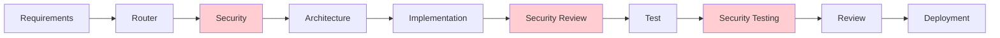
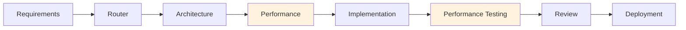

# AI Agents Overview

HUG AI employs a **multi-agent system** where specialized AI agents collaborate to deliver complete software development solutions while maintaining human oversight and governance at every critical decision point.

## Agent Architecture

### 🤖 **What is a HUG AI Agent?**

A HUG AI agent is a specialized AI system that:

- **Focuses on specific expertise**: Each agent masters a particular aspect of software development
- **Operates under governance**: All actions require human validation at defined checkpoints
- **Maintains context**: Preserves project knowledge and decision history
- **Ensures traceability**: Every action is logged and auditable
- **Adapts to technology**: Works across any programming language or framework

### 🏗️ **Agent Design Principles**

**Human-Centric Control**
- Agents assist and accelerate human developers, never replace them
- Critical decisions always involve human judgment and approval
- Transparent operation with complete audit trails

**Specialized Expertise**
- Each agent is optimized for specific development tasks
- Deep domain knowledge in their area of specialization
- Consistent application of best practices and standards

**Collaborative Intelligence**
- Agents share context and coordinate activities
- Intelligent handoffs between agents preserve project knowledge
- Parallel execution where appropriate for efficiency

## Core Agent Portfolio

### 📋 **Planning & Analysis Agents**

| Agent | Specialization | Key Capabilities |
|-------|----------------|------------------|
| **[Prompt Refiner](prompt_refiner_agent.md)** | Task Clarification | Optimizes requirements, clarifies scope, ensures completeness |
| **[Requirements Analyzer](requirements_analyzer_agent.md)** | Requirements Engineering | Analyzes stakeholder needs, validates requirements, identifies gaps |
| **[Router](router_agent.md)** | Workflow Orchestration | Intelligent task routing, agent coordination, fallback management |

### 🏛️ **Design & Architecture Agents**

| Agent | Specialization | Key Capabilities |
|-------|----------------|------------------|
| **[Architecture](architecture_agent.md)** | System Design | Creates scalable architectures, defines patterns, ensures consistency |
| **[Security](security_agent.md)** | Security Analysis | Vulnerability assessment, security best practices, compliance validation |
| **[Performance](performance_agent.md)** | Performance Optimization | Scalability analysis, performance tuning, bottleneck identification |

### 💻 **Implementation & Quality Agents**

| Agent | Specialization | Key Capabilities |
|-------|----------------|------------------|
| **[Implementation](implementation_agent.md)** | Code Generation | Universal coding across all languages, pattern implementation, best practices |
| **[Test](test_agent.md)** | Quality Assurance | Comprehensive testing (unit, integration, e2e), test automation |
| **[Documentation Writer](documentation_writer_agent.md)** | Technical Documentation | API docs, user guides, technical specifications, knowledge management |
| **[Internal Reviewer](internal_reviewer_agent.md)** | Code Review | Quality assessment, best practice enforcement, improvement suggestions |

### 🚀 **Integration & Operations Agents**

| Agent | Specialization | Key Capabilities |
|-------|----------------|------------------|
| **[Integration](integration_agent.md)** | System Integration | API management, data pipelines, service orchestration |
| **[Branch/PR Manager](branch_pr_manager_agent.md)** | Version Control | Git operations, pull request management, branch strategies |
| **[DevOps](devops_agent.md)** | Infrastructure Automation | CI/CD pipelines, infrastructure as code, operational excellence |
| **[Deployment](deployment_agent.md)** | Release Management | Deployment automation, environment management, rollback strategies |
| **[Maintenance](maintenance_agent.md)** | System Maintenance | Health monitoring, dependency updates, proactive maintenance |

### 🔄 **Support & Recovery Agents**

| Agent | Specialization | Key Capabilities |
|-------|----------------|------------------|
| **[Retry](retry_agent.md)** | Failure Recovery | Intelligent error analysis, task recovery, learning from failures |

## Agent Orchestration Workflows

### 🔄 **Standard Development Flow**


### 🔒 **Security-Critical Flow**



### ⚡ **Performance-Critical Flow**



## Human Governance Integration

### 🎯 **Governance Checkpoints**

Agents operate with built-in governance checkpoints:

- **After Requirements Analysis**: Business validation and stakeholder approval
- **After Architecture Design**: Technical review and security assessment
- **After Implementation**: Code quality review and testing validation
- **Before Deployment**: Production readiness and final approval

### 👥 **Approval Workflows**

```yaml
# .hugai/governance.yaml
approval_workflows:
  requirements_changes:
    approvers: ["product-manager", "business-analyst"]
    timeout: "24h"
    
  architecture_changes:
    approvers: ["tech-lead", "principal-architect"]
    timeout: "48h"
    
  security_changes:
    approvers: ["security-lead", "ciso"]
    timeout: "72h"
```

### 📊 **Quality Gates**

Automated quality enforcement with human oversight:

- **Code Coverage**: Minimum 90% with human review for exceptions
- **Security Scanning**: Zero critical vulnerabilities before deployment
- **Performance**: No degradation beyond defined thresholds
- **Documentation**: Complete coverage of public APIs and user features

## Agent Configuration

### 🔧 **Universal Configuration**

All agents operate based on the project configuration:

```yaml
# .hugai/config.yaml
project:
  name: "my-application"
  technology_stack: "typescript_react_node"
  complexity: "high"
  criticality: "business_critical"
  
agents:
  execution_model: "collaborative"
  governance_level: "balanced"  # minimal, balanced, strict
  parallel_execution: true
  context_sharing: true
  
quality:
  code_coverage_threshold: 90
  security_scan_level: "comprehensive"
  performance_targets: "high"
  documentation_completeness: "full"
```

### 🎛️ **Agent-Specific Configuration**

Each agent can be customized for specific needs:

```yaml
# .hugai/agents/implementation.yaml
implementation_agent:
  languages: ["typescript", "python", "go"]
  frameworks: ["react", "django", "gin"]
  coding_standards: "strict"
  test_generation: true
  documentation_inline: true
  
  patterns:
    - "clean_architecture"
    - "dependency_injection"
    - "repository_pattern"
```

## Benefits of Multi-Agent Architecture

### 🚀 **For Development Teams**

- **Accelerated Development**: 3-5x faster development cycles
- **Consistent Quality**: Standardized best practices across all code
- **Reduced Cognitive Load**: Agents handle routine tasks
- **Knowledge Amplification**: Junior developers produce senior-level output

### 🏢 **For Organizations**

- **Predictable Outcomes**: Consistent, high-quality deliverables
- **Risk Mitigation**: Built-in governance and quality assurance
- **Cost Efficiency**: Reduced development costs per feature
- **Scalable Processes**: Same quality across all team sizes

### 🎯 **For Project Success**

- **Faster Time-to-Market**: Accelerated development with maintained quality
- **Lower Defect Rates**: Comprehensive testing and review processes
- **Better Documentation**: Automated generation and maintenance
- **Enhanced Security**: Proactive security analysis and enforcement

## Getting Started with Agents

### 📚 **Agent Documentation**

Explore detailed documentation for each agent:

1. **Start with Core Agents**: Requirements Analyzer, Architecture, Implementation
2. **Add Quality Agents**: Test, Security, Internal Reviewer
3. **Implement Operations**: DevOps, Deployment, Maintenance
4. **Customize for Needs**: Configure agents for your specific requirements

### 🛠️ **Quick Start**

```bash
# Initialize HUG AI with agents
hugai init --agents core,quality,operations

# Configure agents for your project
hugai config agents --governance balanced --quality high

# Run agent workflow
hugai run --task "implement user authentication"

# Monitor agent activity
hugai status --agents --live
```

### 📖 **Recommended Reading Order**

1. **[Router Agent](router_agent.md)**: Understand workflow orchestration
2. **[Requirements Analyzer](requirements_analyzer_agent.md)**: Learn requirement engineering
3. **[Architecture Agent](architecture_agent.md)**: Explore system design capabilities
4. **[Implementation Agent](implementation_agent.md)**: Discover code generation features
5. **[Test Agent](test_agent.md)**: Understand quality assurance automation

---

The HUG AI agent system provides a comprehensive, intelligent development environment that amplifies human capabilities while maintaining the oversight and governance essential for professional software development.

*Each agent is designed to excel in their domain while collaborating seamlessly with both humans and other agents to deliver exceptional software.*


