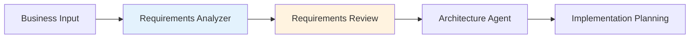
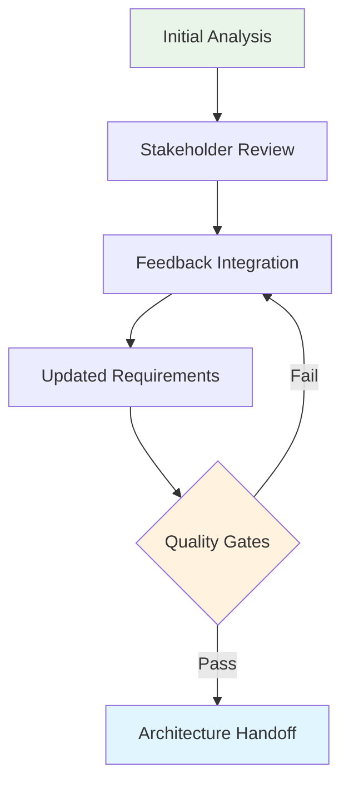

# Requirements Analyzer Agent

The **Requirements Analyzer Agent** is a specialized AI system that excels at **requirements engineering** - the critical process of transforming stakeholder needs, business objectives, and user stories into clear, actionable, and traceable requirements for software development.

## 🎯 Agent Overview

### **Core Mission**
Transform abstract business needs into structured, implementable requirements while ensuring completeness, consistency, and traceability throughout the development lifecycle.

### **Key Capabilities**
- **Requirement Extraction**: Parse complex business documents and conversations
- **Ambiguity Detection**: Identify unclear, incomplete, or conflicting requirements
- **Stakeholder Analysis**: Map requirements to business stakeholders and use cases
- **Dependency Mapping**: Identify relationships and dependencies between requirements
- **Quality Validation**: Ensure requirements meet quality standards (SMART criteria)

## 📋 Input Processing

### **Accepted Input Formats**

**Business Documentation**
- User stories and epics
- Business requirement documents (BRDs)
- Meeting transcripts and notes
- Product roadmap documents
- Stakeholder interview recordings

**Technical Context**
- Existing system documentation
- Technical constraints and limitations
- Integration requirements
- Performance and scalability targets

**Project Artifacts**
- Project charter and scope statements
- Business process diagrams
- User personas and journey maps
- Competitive analysis reports

### **Context Integration**

```yaml
# Example input context configuration
context_sources:
  business:
    - business_goals.md
    - user_personas.md
    - market_analysis.md
  technical:
    - system_architecture.md
    - technical_constraints.md
    - integration_points.md
  regulatory:
    - compliance_requirements.md
    - security_policies.md
    - data_protection_guidelines.md
```

## 📤 Output Deliverables

### **Structured Requirements Specification**

```yaml
# requirements.yaml - Primary output
project_info:
  name: "User Authentication System"
  version: "1.0.0"
  created: "2024-01-15"
  analyst: "requirements_analyzer_agent"
  stakeholders: ["product_manager", "tech_lead", "security_lead"]

functional_requirements:
  - id: FR-001
    title: "Email/Password Authentication"
    description: "Users must be able to authenticate using email and password"
    priority: "high"
    complexity: "medium"
    effort_estimate: "5 story points"
    acceptance_criteria:
      - "User can enter email and password"
      - "System validates credentials against database"
      - "Invalid credentials show appropriate error message"
      - "Successful login redirects to dashboard"
    dependencies: ["FR-002", "NFR-001"]
    stakeholders: ["end_users", "product_manager"]
    business_value: "Enable secure user access to the platform"
    
  - id: FR-002
    title: "User Registration"
    description: "New users must be able to create accounts"
    priority: "high"
    complexity: "medium"
    effort_estimate: "8 story points"
    acceptance_criteria:
      - "User can provide email, password, and basic profile info"
      - "System validates email uniqueness"
      - "Password meets security requirements"
      - "Email verification required before account activation"
    dependencies: ["NFR-002"]
    stakeholders: ["end_users", "marketing_team"]
    business_value: "Enable user acquisition and onboarding"

non_functional_requirements:
  - id: NFR-001
    title: "Authentication Security"
    description: "Password storage and authentication security standards"
    category: "security"
    priority: "critical"
    requirements:
      - "Passwords must be hashed using bcrypt or equivalent"
      - "Failed login attempts limited to 5 per 15-minute window"
      - "Session tokens expire after 24 hours"
      - "HTTPS required for all authentication endpoints"
    validation_criteria:
      - "Security penetration testing passes"
      - "Compliance audit approval"
    stakeholders: ["security_team", "compliance_team"]
    
  - id: NFR-002
    title: "Registration Performance"
    description: "User registration performance requirements"
    category: "performance"
    priority: "medium"
    requirements:
      - "Registration process completes within 3 seconds"
      - "Email verification sent within 30 seconds"
      - "System handles 100 concurrent registrations"
    validation_criteria:
      - "Load testing confirms performance targets"
      - "Monitoring shows 95th percentile response times"
    stakeholders: ["technical_team", "operations_team"]

business_rules:
  - id: BR-001
    title: "Email Uniqueness"
    description: "Each email address can only be associated with one account"
    rationale: "Prevent duplicate accounts and ensure user identity integrity"
    
  - id: BR-002
    title: "Password Complexity"
    description: "Passwords must be minimum 8 characters with mixed case and numbers"
    rationale: "Ensure baseline security for user accounts"

user_stories:
  - id: US-001
    title: "User Login"
    as_a: "registered user"
    i_want: "to log into my account"
    so_that: "I can access my personal dashboard and data"
    linked_requirements: ["FR-001", "NFR-001"]
    
  - id: US-002
    title: "User Registration"
    as_a: "potential user"
    i_want: "to create a new account"
    so_that: "I can start using the platform services"
    linked_requirements: ["FR-002", "NFR-002"]

risks_and_assumptions:
  risks:
    - id: RISK-001
      description: "Third-party email service integration dependency"
      impact: "high"
      probability: "low"
      mitigation: "Implement fallback email service provider"
      
  assumptions:
    - id: ASMP-001
      description: "Users have access to email for verification"
      validation_needed: true
      
traceability_matrix:
  - business_goal: "Secure user access"
    requirements: ["FR-001", "NFR-001", "BR-001", "BR-002"]
    test_cases: ["TC-001", "TC-002", "TC-003"]
    
validation_checklist:
  completeness:
    - "All user personas addressed"
    - "All business processes covered"
    - "Integration points identified"
    
  quality:
    - "Requirements follow SMART criteria"
    - "Acceptance criteria are testable"
    - "Dependencies clearly identified"
    
  stakeholder_approval:
    - product_manager: "pending"
    - tech_lead: "pending"
    - security_lead: "pending"
```

### **Analysis Reports**

```markdown
# Requirements Analysis Report

## Executive Summary
- **Total Requirements**: 15 (10 functional, 5 non-functional)
- **Priority Distribution**: 8 high, 5 medium, 2 low
- **Estimated Effort**: 45 story points
- **Risk Level**: Medium

## Quality Assessment
- **Completeness Score**: 85% (3 areas need clarification)
- **Consistency Score**: 92% (2 minor conflicts identified)
- **Testability Score**: 88% (all requirements have acceptance criteria)

## Recommendations
1. Clarify data retention requirements with legal team
2. Define specific performance thresholds for mobile users
3. Validate assumptions about user email access patterns

## Next Steps
1. Stakeholder review and approval
2. Architecture agent analysis
3. Technical feasibility assessment
```

## 🔍 Analysis Capabilities

### **Requirement Quality Analysis**

**SMART Criteria Validation**
- **Specific**: Requirements clearly define what needs to be built
- **Measurable**: Success criteria and acceptance tests are defined
- **Achievable**: Technical and business feasibility assessed
- **Relevant**: Alignment with business goals validated
- **Time-bound**: Implementation timeline and priorities established

**Consistency Checking**
- Cross-reference requirements for conflicts
- Validate business rules alignment
- Ensure terminology consistency
- Check priority and dependency logic

### **Stakeholder Analysis**

```yaml
stakeholder_mapping:
  primary:
    - role: "Product Manager"
      interests: ["business_value", "user_experience", "time_to_market"]
      influence: "high"
      requirements_ownership: ["FR-001", "FR-002", "US-001", "US-002"]
      
  secondary:
    - role: "Technical Lead"
      interests: ["technical_feasibility", "maintainability", "scalability"]
      influence: "high"
      requirements_ownership: ["NFR-001", "NFR-002"]
      
  compliance:
    - role: "Security Team"
      interests: ["security", "compliance", "risk_mitigation"]
      influence: "medium"
      requirements_ownership: ["NFR-001", "BR-002"]
```

### **Gap Analysis**

Identifies missing or incomplete requirements:

- **Functional Gaps**: Missing user workflows or system capabilities
- **Non-functional Gaps**: Undefined performance, security, or usability requirements
- **Integration Gaps**: Missing external system requirements
- **Compliance Gaps**: Regulatory or policy requirements not addressed

## 🔧 Configuration Options

### **Agent Configuration**

```yaml
# .hugai/agents/requirements_analyzer.yaml
requirements_analyzer:
  analysis_depth: "comprehensive"  # basic, standard, comprehensive
  validation_level: "strict"       # lenient, standard, strict
  output_format: "yaml"           # yaml, json, markdown
  
  quality_standards:
    completeness_threshold: 85
    consistency_threshold: 90
    testability_threshold: 95
    
  stakeholder_analysis:
    enabled: true
    mapping_required: true
    approval_tracking: true
    
  documentation_generation:
    requirements_specification: true
    analysis_report: true
    traceability_matrix: true
    stakeholder_summary: true
    
  integration:
    architecture_agent: true
    test_agent: true
    documentation_agent: true
    
  templates:
    functional_requirement: "templates/functional_req.yaml"
    non_functional_requirement: "templates/nfr_req.yaml"
    user_story: "templates/user_story.yaml"
```

### **Quality Gates**

```yaml
quality_gates:
  requirement_completeness:
    threshold: 85
    blocking: true
    
  stakeholder_coverage:
    threshold: 100
    blocking: true
    
  acceptance_criteria:
    threshold: 95
    blocking: false
    
  dependency_mapping:
    threshold: 90
    blocking: false
```

## 🔄 Workflow Integration

### **Sequential Integration**



### **Iterative Refinement**



## 👥 Human Governance

### **Review Checkpoints**

**Mandatory Reviews**
- **Completeness Review**: Validate all business needs are captured
- **Quality Review**: Ensure requirements meet SMART criteria
- **Stakeholder Review**: Confirm alignment with business objectives
- **Technical Review**: Validate feasibility and technical constraints

**Approval Workflow**

```yaml
approval_workflow:
  stages:
    - stage: "initial_review"
      approvers: ["business_analyst", "product_manager"]
      criteria: ["completeness", "business_alignment"]
      timeout: "48h"
      
    - stage: "technical_review"
      approvers: ["technical_lead", "architect"]
      criteria: ["feasibility", "technical_constraints"]
      timeout: "72h"
      
    - stage: "final_approval"
      approvers: ["product_owner", "project_manager"]
      criteria: ["overall_quality", "readiness"]
      timeout: "24h"
```

### **Change Management**

```yaml
change_management:
  impact_assessment:
    - "scope_change"
    - "effort_impact"
    - "timeline_impact"
    - "stakeholder_impact"
    
  approval_thresholds:
    minor_changes: ["business_analyst"]
    major_changes: ["product_manager", "technical_lead"]
    scope_changes: ["product_owner", "project_manager"]
```

## 📈 Success Metrics

### **Quality Metrics**
- **Requirement Completeness**: Target 95%+ coverage of business needs
- **Requirement Quality**: 90%+ meet SMART criteria
- **Stakeholder Satisfaction**: 4.5/5+ approval rating
- **Change Requests**: <10% requirement changes after approval

### **Process Metrics**
- **Analysis Time**: Average 2-3 days for complex projects
- **Review Cycles**: Target 1-2 cycles for approval
- **Stakeholder Engagement**: 100% key stakeholder participation
- **Documentation Quality**: 95%+ completeness score

## 🚀 Getting Started

### **Quick Start Checklist**

- [ ] Configure stakeholder mapping
- [ ] Define quality standards and thresholds
- [ ] Set up approval workflows
- [ ] Prepare business input documents
- [ ] Configure integration with architecture agent
- [ ] Set up requirement tracking and traceability

### **Best Practices**

1. **Engage Stakeholders Early**: Include all key stakeholders in the analysis process
2. **Use Structured Input**: Provide clear, organized business documentation
3. **Validate Assumptions**: Explicitly identify and validate all assumptions
4. **Maintain Traceability**: Ensure clear links between business goals and requirements
5. **Iterate and Refine**: Use feedback loops to continuously improve requirement quality

---

The Requirements Analyzer Agent ensures that every project begins with a solid foundation of clear, complete, and traceable requirements, setting the stage for successful development outcomes.

*Quality requirements are the foundation of quality software - invest the time upfront to ensure project success.*


