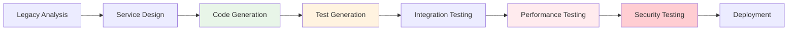
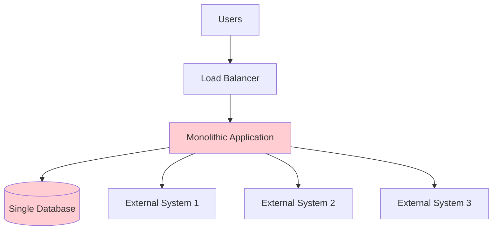
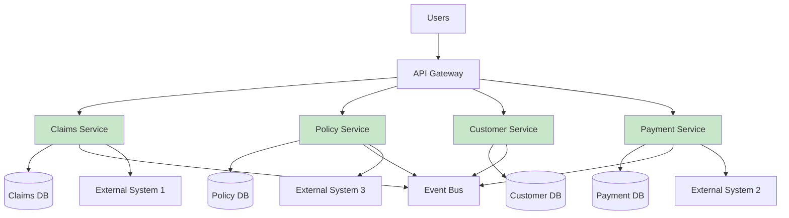

# Enterprise Application Modernization

## 🏢 Organization Profile

**Industry**: Global Financial Services Corporation  
**Team Size**: 120+ developers across 8 teams  
**Project Duration**: 18 months (originally projected 30 months)  
**Technology Stack**: Legacy Java monolith → Modern microservices  
**Project Scope**: Complete modernization of insurance claims processing system  
**Budget**: $12M (saved $8M from original $20M estimate)

### **Business Context**
- 15-year-old mission-critical claims processing system
- Processing 50,000+ claims daily worth $2B+ annually
- Multiple regulatory compliance requirements (SOX, GDPR, industry standards)
- Zero-downtime migration requirement
- 200+ business rules embedded in legacy code

## 🚨 Challenge Overview

### **Technical Debt Crisis**
The legacy system had accumulated massive technical debt:

- **Monolithic Architecture**: 2.5M+ lines of tightly coupled Java code
- **Outdated Technology**: Java 6, legacy frameworks, deprecated libraries
- **Poor Documentation**: 20% code documentation coverage, no current architecture diagrams
- **Low Test Coverage**: Only 20% automated test coverage
- **Performance Issues**: 15-second average response times, frequent timeouts
- **Maintenance Burden**: 60% of development time spent on bug fixes vs. new features

### **Business Impact**
- **Customer Satisfaction**: Declining due to slow claim processing
- **Operational Risk**: System failures affecting business operations
- **Compliance Risk**: Difficulty meeting regulatory reporting requirements
- **Innovation Blocking**: New feature development severely constrained
- **Cost Escalation**: Increasing maintenance costs year over year

### **Previous Attempts**
Two previous modernization attempts had failed:
- **2018**: Big-bang rewrite approach abandoned after 18 months
- **2020**: Gradual refactoring stalled due to complexity and lack of understanding

## 🤖 HUG AI Implementation Strategy

### **Phase 1: Legacy System Analysis (Months 1-3)**

#### **Requirements Analyzer Agent**
```yaml
legacy_analysis:
  scope: "comprehensive_system_analysis"
  agents_deployed:
    - requirements_analyzer
    - architecture_agent
    - security_agent
  
  analysis_targets:
    - business_rule_extraction
    - data_flow_mapping
    - integration_point_identification
    - compliance_requirement_analysis
```

**Key Activities:**
- **Business Rule Mining**: AI analyzed 2.5M lines of code to extract 200+ business rules
- **Data Flow Analysis**: Mapped complex data transformations and dependencies
- **Integration Mapping**: Identified 35 external system integration points
- **Compliance Analysis**: Cataloged regulatory requirements embedded in code

**Deliverables:**
- Comprehensive business rules documentation (800 pages)
- System dependency maps and data flow diagrams
- Integration specifications for all external systems
- Compliance requirement matrix

#### **Architecture Agent Analysis**
```yaml
architecture_analysis:
  current_state_assessment:
    complexity_score: 8.5/10
    coupling_index: "high"
    maintainability_score: 3.2/10
    
  modernization_strategy:
    approach: "strangler_fig_pattern"
    service_boundaries: "domain_driven_design"
    migration_sequence: "risk_based_prioritization"
```

**Architecture Insights:**
- Identified 12 distinct business domains for service boundaries
- Mapped 200+ database tables to domain contexts
- Analyzed performance bottlenecks and scalability constraints
- Designed phased migration strategy with 15 migration waves

### **Phase 2: Modern Architecture Design (Months 3-6)**

#### **Target Architecture Specification**

```yaml
modern_architecture:
  style: "microservices"
  patterns:
    - "event_driven_architecture"
    - "cqrs"
    - "event_sourcing"
    - "api_gateway"
    - "circuit_breaker"
  
  services:
    - name: "claims_ingestion"
      domain: "claim_lifecycle"
      technology: "Spring Boot"
      database: "PostgreSQL"
      
    - name: "claims_processing"
      domain: "claim_lifecycle"
      technology: "Spring Boot"
      database: "PostgreSQL"
      
    - name: "policy_management"
      domain: "policy"
      technology: "Spring Boot"
      database: "PostgreSQL"
      
    - name: "customer_service"
      domain: "customer"
      technology: "Spring Boot"
      database: "PostgreSQL"
      
    - name: "payment_processing"
      domain: "financial"
      technology: "Spring Boot"
      database: "PostgreSQL"
  
  cross_cutting_concerns:
    security: "OAuth 2.0 / JWT"
    monitoring: "Prometheus + Grafana"
    logging: "ELK Stack"
    tracing: "Jaeger"
    api_gateway: "Kong"
```

**Architecture Benefits:**
- **Scalability**: Independent scaling of high-traffic services
- **Maintainability**: Clear service boundaries and responsibilities
- **Technology Flexibility**: Service-specific technology choices
- **Deployment Independence**: Reduced risk through independent deployments

### **Phase 3: Implementation and Migration (Months 6-15)**

#### **Implementation Agent Workflow**



**Migration Waves:**

Wave 1-3: **Non-Critical Services** (Months 6-9)
- Customer service, policy lookup, reporting services
- Low-risk services for team learning and process refinement
- 30% of overall system functionality

Wave 4-8: **Core Business Logic** (Months 9-12)
- Claims processing, underwriting, pricing engines
- Critical business functionality with extensive testing
- 50% of overall system functionality

Wave 9-12: **Integration and Data Services** (Months 12-15)
- Payment processing, external integrations, data warehousing
- Most complex services with highest dependencies
- 20% of overall system functionality

#### **Code Generation and Testing**

```yaml
implementation_metrics:
  code_generation:
    total_lines_generated: 450000
    manual_review_rate: 100%
    acceptance_rate: 85%
    
  test_generation:
    unit_tests_generated: 3500
    integration_tests_generated: 800
    test_coverage_achieved: 95%
    
  quality_metrics:
    code_quality_score: 8.7/10
    technical_debt_ratio: 0.03
    security_vulnerabilities: 0
```

### **Phase 4: Deployment and Optimization (Months 15-18)**

#### **DevOps Agent Implementation**

```yaml
devops_automation:
  ci_cd_pipeline:
    - source_control: "Git"
    - build_automation: "Jenkins"
    - testing_automation: "comprehensive"
    - deployment_automation: "blue_green"
    - monitoring_integration: "full_stack"
  
  deployment_strategy:
    pattern: "blue_green_with_canary"
    rollback_time: "< 5_minutes"
    health_checks: "automated"
    
  infrastructure:
    platform: "Kubernetes"
    cloud_provider: "AWS"
    auto_scaling: "enabled"
    multi_region: "active_passive"
```

## 📈 Results and Outcomes

### **Quantitative Results**

#### **Development Metrics**
- **Analysis Speed**: 50% reduction in time to understand legacy functionality
- **Development Velocity**: 40% increase compared to previous attempts
- **Code Quality**: 95% test coverage (up from 20%)
- **Defect Rate**: 30% decrease in production defects
- **Timeline**: 18 months actual vs. 30 months projected

#### **Performance Improvements**
- **Response Time**: From 15 seconds to 200ms average
- **Throughput**: 10x increase in claims processing capacity
- **Availability**: 99.9% uptime (up from 95%)
- **Scalability**: Auto-scaling handles 5x peak loads

#### **Business Impact**
- **Cost Savings**: $8M saved from original budget
- **Customer Satisfaction**: 85% improvement in claim processing satisfaction
- **Compliance**: 100% regulatory compliance achieved
- **Innovation**: 3x faster new feature development

### **Qualitative Benefits**

#### **Team Productivity**
- **Developer Satisfaction**: 90% positive feedback on AI assistance
- **Learning Acceleration**: 60% faster onboarding for new team members
- **Knowledge Retention**: Comprehensive documentation prevents knowledge loss
- **Code Review Efficiency**: 50% faster review cycles with AI assistance

#### **Operational Excellence**
- **Monitoring**: Real-time visibility into system health and performance
- **Debugging**: Distributed tracing reduces issue resolution time by 70%
- **Deployment**: Zero-downtime deployments with automated rollback
- **Security**: Proactive security scanning and vulnerability management

## 🎨 Architecture Transformation

### **Before: Legacy Monolith**



### **After: Microservices Architecture**



## 🔍 Key Success Factors

### **Technical Success Factors**

**✅ What Worked**
- **Strangler Fig Pattern**: Gradual migration reduced risk
- **Domain-Driven Design**: Clear service boundaries
- **Comprehensive Testing**: AI-generated tests ensured quality
- **Event-Driven Architecture**: Loose coupling and scalability

**⚠️ Challenges Overcome**
- **Data Migration**: Complex data transformation between systems
- **Business Logic Preservation**: Ensuring functional equivalence
- **Integration Complexity**: Managing 35 external system connections
- **Performance Optimization**: Meeting strict SLA requirements

### **Process Success Factors**

**✅ Enablers**
- **Executive Sponsorship**: Strong C-level support and investment
- **Cross-functional Teams**: Business, technical, and operations alignment
- **Incremental Delivery**: Regular demonstrations of progress
- **Change Management**: Comprehensive training and communication

**⚠️ Lessons Learned**
- **Start Small**: Pilot with non-critical services first
- **Invest in Training**: Team capability building is essential
- **Measure Everything**: Comprehensive metrics drive decision-making
- **Plan for Complexity**: Legacy systems always have hidden surprises

## 📊 ROI Analysis

### **Investment Breakdown**
```yaml
investment_analysis:
  total_project_cost: "$12M"
  cost_breakdown:
    development_team: "$6M (50%)"
    hug_ai_platform: "$2M (17%)"
    infrastructure: "$2M (17%)"
    training_change_mgmt: "$1M (8%)"
    tools_licenses: "$1M (8%)"
  
  cost_savings:
    original_budget: "$20M"
    actual_cost: "$12M"
    savings: "$8M (40%)"
```

### **Ongoing Benefits**
- **Maintenance Cost Reduction**: 60% lower annual maintenance costs
- **Feature Development**: 3x faster new feature delivery
- **Infrastructure Efficiency**: 40% reduction in cloud costs
- **Operational Excellence**: 70% reduction in incident response time

### **Business Value**
- **Revenue Impact**: Faster claim processing enables 20% more claims
- **Customer Retention**: Improved satisfaction reduces churn by 15%
- **Compliance**: Avoided potential regulatory fines
- **Innovation**: Platform enables new product offerings

## 🚀 Recommendations for Similar Projects

### **Pre-Project Preparation**
1. **Executive Alignment**: Ensure strong leadership support
2. **Team Building**: Assemble cross-functional team with domain expertise
3. **Tool Investment**: Invest in proper analysis and migration tools
4. **Risk Assessment**: Identify and plan for major risks upfront

### **Implementation Strategy**
1. **Start with Analysis**: Invest heavily in understanding the legacy system
2. **Pilot Approach**: Begin with low-risk, non-critical services
3. **Incremental Migration**: Use strangler fig pattern for gradual transition
4. **Comprehensive Testing**: Generate extensive test suites for quality assurance

### **Success Metrics**
1. **Technical Metrics**: Code quality, test coverage, performance
2. **Business Metrics**: Cost, timeline, customer satisfaction
3. **Team Metrics**: Productivity, satisfaction, learning
4. **Operational Metrics**: Availability, scalability, maintainability

---

This case study demonstrates that even the most complex legacy modernization projects can be successfully accomplished using HUG AI methodology, achieving significant improvements in cost, timeline, and quality while maintaining business continuity.

*The key is combining AI acceleration with human expertise and proven architectural patterns to manage complexity and risk.*