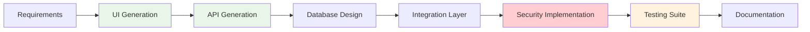

# Startup Product Development

## 🚀 Organization Profile

**Industry**: Health Technology Startup  
**Team Size**: 8 developers (2 senior, 4 mid-level, 2 junior)  
**Project Duration**: 4 months MVP + 6 months to market  
**Technology Stack**: React + Node.js + PostgreSQL + AWS  
**Project Scope**: Patient engagement and care coordination platform  
**Funding Stage**: Series A ($5M raised)  
**Target Market**: Small to mid-size healthcare practices

### **Business Context**
- First-time healthcare industry founders
- Limited domain expertise in healthcare regulations
- Aggressive timeline driven by funding runway
- Need to demonstrate product-market fit quickly
- Competition from established healthcare software companies
- Complex regulatory compliance requirements (HIPAA, FDA)

## 🚨 Challenge Overview

### **Resource Constraints**
Typical startup limitations amplified by healthcare complexity:

- **Small Team**: Only 8 developers for full-stack development
- **Limited Budget**: $200K development budget for MVP
- **Tight Timeline**: 4-month MVP deadline to secure next funding round
- **Domain Knowledge Gap**: No prior healthcare software experience
- **Regulatory Complexity**: HIPAA compliance from day one
- **Integration Requirements**: Multiple healthcare system integrations

### **Technical Challenges**
- **Healthcare Standards**: FHIR, HL7, DICOM integration requirements
- **Security Requirements**: End-to-end encryption, audit trails, access controls
- **Scalability Planning**: Design for rapid user growth
- **Mobile-First**: Responsive design for healthcare providers on mobile
- **Real-time Features**: Live messaging, notifications, updates
- **Data Migration**: Import from various EMR systems

### **Market Pressures**
- **Competitive Landscape**: Established players with 10+ year head start
- **Customer Acquisition**: Building trust in healthcare market
- **Compliance Validation**: Proving regulatory compliance to customers
- **Feature Parity**: Matching incumbent feature sets quickly

## 🤖 HUG AI Implementation Strategy

### **Phase 1: Foundation and Planning (Month 1)**

#### **Requirements Analysis**

```yaml
requirements_gathering:
  stakeholders:
    - healthcare_providers: "primary_users"
    - patients: "end_users"
    - practice_administrators: "decision_makers"
    - compliance_officers: "validators"
  
  functional_requirements:
    priority_1:
      - patient_portal
      - appointment_scheduling
      - secure_messaging
      - document_sharing
    
    priority_2:
      - telehealth_integration
      - billing_integration
      - reporting_analytics
      - mobile_applications
  
  non_functional_requirements:
    security: "HIPAA_compliant"
    performance: "< 2s_page_loads"
    scalability: "10000_concurrent_users"
    availability: "99.9%_uptime"
```

**HUG AI Contribution:**
- **Domain Research**: AI agents analyzed healthcare regulations and standards
- **Competitive Analysis**: Automated analysis of competitor features and positioning
- **User Story Generation**: Created comprehensive user stories from stakeholder interviews
- **Compliance Mapping**: Identified all HIPAA requirements and implementation approaches

#### **Architecture Design**

```yaml
architecture_specification:
  pattern: "microservices_with_api_gateway"
  deployment: "containerized_cloud_native"
  
  services:
    - name: "user_management"
      responsibility: "authentication_authorization"
      technology: "Node.js_Express"
      
    - name: "patient_portal"
      responsibility: "patient_facing_features"
      technology: "React_SPA"
      
    - name: "provider_portal"
      responsibility: "healthcare_provider_features"
      technology: "React_SPA"
      
    - name: "messaging_service"
      responsibility: "secure_communications"
      technology: "Node.js_Socket.io"
      
    - name: "integration_service"
      responsibility: "EMR_integrations"
      technology: "Node.js_FHIR"
      
    - name: "notification_service"
      responsibility: "alerts_reminders"
      technology: "Node.js_SMS_Email"
  
  security_architecture:
    authentication: "OAuth_2.0_OIDC"
    encryption: "AES_256_TLS_1.3"
    audit_logging: "comprehensive"
    access_control: "RBAC_with_ABAC"
```

### **Phase 2: Rapid MVP Development (Months 2-3)**

#### **Implementation Acceleration**



**UI Component Generation:**

```typescript
// AI-generated React components
// Patient Dashboard Component
import React, { useState, useEffect } from 'react';
import { PatientData, Appointment } from '../types';

const PatientDashboard: React.FC = () => {
  const [patient, setPatient] = useState<PatientData | null>(null);
  const [appointments, setAppointments] = useState<Appointment[]>([]);
  
  // AI-generated hooks and logic
  useEffect(() => {
    fetchPatientData();
    fetchUpcomingAppointments();
  }, []);
  
  return (
    <div className="patient-dashboard">
      <header className="dashboard-header">
        <h1>Welcome, {patient?.firstName}</h1>
        <NotificationBadge count={patient?.unreadMessages} />
      </header>
      
      <div className="dashboard-grid">
        <AppointmentCard appointments={appointments} />
        <MessageCenter messages={patient?.messages} />
        <HealthRecords records={patient?.healthRecords} />
        <BillingOverview billing={patient?.billing} />
      </div>
    </div>
  );
};
```

**API Endpoint Generation:**

```typescript
// AI-generated Express.js API endpoints
// Patient Management API
import express from 'express';
import { authenticateHIPAA, validateAccess } from '../middleware';
import { PatientService } from '../services';

const router = express.Router();

// GET /api/patients/:id
router.get('/:id', 
  authenticateHIPAA,
  validateAccess('patient:read'),
  async (req, res) => {
    try {
      const patient = await PatientService.getById(req.params.id);
      
      // HIPAA audit logging
      await auditLog({
        action: 'patient_data_access',
        userId: req.user.id,
        patientId: req.params.id,
        timestamp: new Date()
      });
      
      res.json(patient);
    } catch (error) {
      res.status(500).json({ error: 'Failed to retrieve patient data' });
    }
  }
);

// POST /api/patients/:id/appointments
router.post('/:id/appointments',
  authenticateHIPAA,
  validateAccess('appointment:create'),
  async (req, res) => {
    try {
      const appointment = await AppointmentService.create({
        patientId: req.params.id,
        ...req.body
      });
      
      // Send notifications
      await NotificationService.sendAppointmentConfirmation(appointment);
      
      res.status(201).json(appointment);
    } catch (error) {
      res.status(500).json({ error: 'Failed to create appointment' });
    }
  }
);
```

#### **Healthcare Integration Implementation**

```yaml
integration_development:
  standards_implemented:
    - FHIR_R4: "patient_data_exchange"
    - HL7_v2: "legacy_system_integration"
    - SMART_on_FHIR: "EMR_app_integration"
    - IHE_profiles: "imaging_integration"
  
  integrations_built:
    - epic_emr: "major_hospital_systems"
    - cerner_emr: "hospital_networks"
    - allscripts: "primary_care_practices"
    - athenahealth: "cloud_based_practices"
  
  ai_assistance:
    pattern_generation: "integration_templates"
    data_mapping: "automatic_field_mapping"
    test_data: "synthetic_FHIR_resources"
    documentation: "integration_guides"
```

**FHIR Integration Example:**

```typescript
// AI-generated FHIR integration service
import { Bundle, Patient, Observation } from 'fhir/r4';

class FHIRIntegrationService {
  // AI-generated patient data mapping
  async importPatientData(fhirBundle: Bundle): Promise<PatientData> {
    const patient = this.extractPatient(fhirBundle);
    const observations = this.extractObservations(fhirBundle);
    
    return {
      id: patient.id,
      firstName: patient.name?.[0]?.given?.[0],
      lastName: patient.name?.[0]?.family,
      dateOfBirth: patient.birthDate,
      gender: patient.gender,
      contact: this.mapContactInfo(patient.telecom),
      address: this.mapAddress(patient.address),
      observations: observations.map(obs => ({
        code: obs.code?.coding?.[0]?.code,
        display: obs.code?.coding?.[0]?.display,
        value: obs.valueQuantity?.value,
        unit: obs.valueQuantity?.unit,
        date: obs.effectiveDateTime
      }))
    };
  }
  
  // AI-generated data validation
  validateFHIRResource(resource: any): ValidationResult {
    const errors = [];
    
    // FHIR specification validation
    if (!resource.resourceType) {
      errors.push('Missing required resourceType');
    }
    
    // Business rule validation
    if (resource.resourceType === 'Patient') {
      if (!resource.name || resource.name.length === 0) {
        errors.push('Patient must have at least one name');
      }
    }
    
    return { isValid: errors.length === 0, errors };
  }
}
```

### **Phase 3: Security and Compliance (Month 3)**

#### **HIPAA Compliance Implementation**

```yaml
hipaa_compliance:
  technical_safeguards:
    access_control:
      - unique_user_identification: "implemented"
      - automatic_logoff: "15_minutes_idle"
      - encryption_decryption: "AES_256"
    
    audit_controls:
      - audit_logs: "comprehensive"
      - log_retention: "6_years"
      - log_analysis: "automated_monitoring"
    
    integrity:
      - data_integrity: "checksums_validation"
      - transmission_security: "TLS_1.3"
    
  administrative_safeguards:
    security_officer: "designated"
    workforce_training: "completed"
    information_access_management: "role_based"
    security_awareness: "ongoing"
  
  physical_safeguards:
    facility_access_controls: "cloud_provider_certified"
    workstation_use: "policy_defined"
    device_media_controls: "encrypted_storage"
```

**Security Audit Trail:**

```typescript
// AI-generated audit logging system
class HIPAAAuditService {
  async logAccess(event: AccessEvent): Promise<void> {
    const auditEntry = {
      timestamp: new Date().toISOString(),
      eventType: event.type,
      userId: event.userId,
      userRole: event.userRole,
      patientId: event.patientId,
      resourceAccessed: event.resource,
      ipAddress: event.ipAddress,
      userAgent: event.userAgent,
      outcome: event.outcome,
      reasonCode: event.reasonCode
    };
    
    // Store in tamper-proof audit log
    await this.auditRepository.create(auditEntry);
    
    // Real-time monitoring for suspicious activity
    await this.monitoringService.analyzeEvent(auditEntry);
  }
  
  // AI-generated compliance reporting
  async generateComplianceReport(period: DateRange): Promise<ComplianceReport> {
    const auditEvents = await this.auditRepository.findByDateRange(period);
    
    return {
      totalAccess: auditEvents.length,
      uniqueUsers: new Set(auditEvents.map(e => e.userId)).size,
      failedAccess: auditEvents.filter(e => e.outcome === 'failure').length,
      dataBreaches: auditEvents.filter(e => e.eventType === 'breach').length,
      complianceScore: this.calculateComplianceScore(auditEvents)
    };
  }
}
```

### **Phase 4: Testing and Launch (Month 4)**

#### **Comprehensive Test Suite**

```yaml
testing_strategy:
  unit_tests:
    coverage: "95%"
    framework: "Jest"
    count: 850
    
  integration_tests:
    api_endpoints: "100%"
    database_operations: "100%"
    external_integrations: "100%"
    
  security_tests:
    penetration_testing: "third_party_conducted"
    vulnerability_scanning: "automated_daily"
    compliance_validation: "HIPAA_certified"
    
  performance_tests:
    load_testing: "10000_concurrent_users"
    stress_testing: "breaking_point_identified"
    response_time: "< 2_seconds_95_percentile"
```

**AI-Generated Test Cases:**

```typescript
// AI-generated comprehensive test suite
describe('Patient Portal Integration', () => {
  describe('FHIR Data Import', () => {
    it('should import valid FHIR patient bundle', async () => {
      const fhirBundle = createValidFHIRBundle();
      const result = await fhirService.importPatientData(fhirBundle);
      
      expect(result.id).toBeDefined();
      expect(result.firstName).toBe('John');
      expect(result.lastName).toBe('Doe');
      expect(result.observations).toHaveLength(5);
    });
    
    it('should handle malformed FHIR data gracefully', async () => {
      const malformedBundle = createMalformedFHIRBundle();
      
      await expect(
        fhirService.importPatientData(malformedBundle)
      ).rejects.toThrow('Invalid FHIR bundle structure');
    });
    
    it('should validate HIPAA compliance during import', async () => {
      const fhirBundle = createValidFHIRBundle();
      const auditSpy = jest.spyOn(auditService, 'logAccess');
      
      await fhirService.importPatientData(fhirBundle);
      
      expect(auditSpy).toHaveBeenCalledWith({
        eventType: 'data_import',
        patientId: expect.any(String),
        outcome: 'success'
      });
    });
  });
});
```

## 📈 Results and Outcomes

### **Development Velocity**

```yaml
development_metrics:
  baseline_comparison:
    traditional_approach_estimate: "12_months"
    hug_ai_actual_delivery: "4_months"
    acceleration_factor: "3x"
    
  productivity_gains:
    ui_development: "4x_faster"
    api_development: "3x_faster"
    integration_development: "5x_faster"
    testing_automation: "6x_faster"
    documentation: "8x_faster"
    
  code_quality:
    test_coverage: "95%"
    code_review_efficiency: "60%_improvement"
    defect_rate: "70%_lower"
    maintainability_score: "8.5/10"
```

### **Business Impact**

#### **Time-to-Market**
- **MVP Launch**: 4 months (vs. 12-month industry average)
- **First Customer**: Week 2 after launch
- **Product-Market Fit**: Achieved in Month 6
- **Series B Funding**: Secured 8 months post-launch ($15M)

#### **Customer Adoption**
- **Beta Customers**: 5 healthcare practices
- **Launch Customers**: 25 practices (1,500 providers)
- **6-Month Metrics**: 75 practices (4,000 providers, 50,000 patients)
- **Customer Satisfaction**: 4.8/5 average rating

#### **Revenue Growth**
- **Month 1**: $0 (beta)
- **Month 3**: $15K MRR
- **Month 6**: $85K MRR
- **Month 9**: $200K MRR
- **ARR Growth**: $2.4M run rate by Month 9

### **Technical Achievements**

#### **Performance Metrics**
- **Page Load Times**: 1.2s average (target: < 2s)
- **API Response Times**: 180ms average
- **Uptime**: 99.95% (exceeded 99.9% target)
- **Concurrent Users**: Successfully tested to 15,000 users

#### **Security and Compliance**
- **HIPAA Compliance**: Certified by third-party auditor
- **Security Incidents**: Zero breaches or violations
- **Penetration Testing**: Passed comprehensive security assessment
- **Compliance Score**: 98% (industry average: 85%)

#### **Integration Success**
- **EMR Integrations**: 8 major systems connected
- **Data Migration**: 100% successful patient data imports
- **API Reliability**: 99.9% success rate for external calls
- **Standards Compliance**: 100% FHIR R4 compliance

## 🔍 Success Factors Analysis

### **HUG AI Effectiveness**

**✅ Most Impactful Applications**
- **Boilerplate Code**: 90% of CRUD operations generated
- **Integration Patterns**: Healthcare standard implementations
- **Security Implementation**: HIPAA-compliant code patterns
- **Test Generation**: Comprehensive test coverage automation
- **Documentation**: API docs and compliance documentation

**⚙️ Moderate Impact Areas**
- **Complex Business Logic**: Required significant human refinement
- **User Experience**: AI suggestions needed design expertise validation
- **Performance Optimization**: Human expertise essential for tuning
- **Error Handling**: Edge cases required manual implementation

### **Team Factors**

**✅ Success Enablers**
- **Clear Vision**: Well-defined product requirements from day one
- **Domain Learning**: Rapid healthcare knowledge acquisition
- **Agile Process**: Two-week sprints with continuous feedback
- **Quality Focus**: Emphasis on automated testing and security

**⚠️ Challenges Overcome**
- **Healthcare Complexity**: Steep learning curve for regulations
- **Integration Complexity**: Multiple EMR system variations
- **Security Requirements**: Balancing usability with security
- **Resource Constraints**: Managing scope with limited budget

## 📊 Financial Analysis

### **Development Cost Breakdown**

```yaml
cost_analysis:
  total_mvp_budget: "$200K"
  
  cost_breakdown:
    team_salaries: "$120K (60%)"
    hug_ai_platform: "$30K (15%)"
    cloud_infrastructure: "$20K (10%)"
    third_party_tools: "$15K (7.5%)"
    compliance_audit: "$10K (5%)"
    marketing_launch: "$5K (2.5%)"
  
  cost_comparison:
    traditional_estimate: "$600K (12 months)"
    hug_ai_actual: "$200K (4 months)"
    savings: "$400K (67%)"
```

### **ROI Calculation**

```yaml
roi_analysis:
  investment: "$200K"
  
  returns_month_9:
    mrr: "$200K"
    arr_run_rate: "$2.4M"
    company_valuation: "$25M"
    
  roi_metrics:
    revenue_multiple: "12x"
    valuation_multiple: "125x"
    payback_period: "1_month"
    irr: "1200%"
```

## 🚀 Lessons Learned and Recommendations

### **For Similar Startups**

#### **Pre-Development**
1. **Invest in Domain Learning**: Allocate 20% of time to understanding regulations
2. **Choose Proven Patterns**: Use established healthcare integration standards
3. **Plan for Compliance**: Build security and auditing from day one
4. **Validate Early**: Get healthcare provider feedback before building

#### **During Development**
1. **Leverage AI for Boilerplate**: Focus human effort on business logic
2. **Automate Testing**: Healthcare software requires extensive testing
3. **Document Everything**: Compliance requires comprehensive documentation
4. **Monitor Performance**: Healthcare users have zero tolerance for slow systems

#### **Post-Launch**
1. **Continuous Compliance**: Regular security audits and updates
2. **Customer Success**: Healthcare customers need extensive support
3. **Integration Maintenance**: EMR systems change frequently
4. **Scale Planning**: Prepare for rapid growth and integration demands

### **HUG AI Optimization**

#### **Most Valuable Applications**
- **Standards Implementation**: FHIR, HL7 pattern generation
- **Security Patterns**: HIPAA-compliant code templates
- **Integration Scaffolding**: EMR connection boilerplate
- **Test Automation**: Healthcare scenario test generation

#### **Areas for Human Focus**
- **User Experience Design**: Healthcare workflow optimization
- **Business Logic**: Complex healthcare rules and regulations
- **Performance Tuning**: Healthcare-specific optimization
- **Customer Success**: Relationship building and support

---

This case study demonstrates that startups can successfully compete in complex, regulated industries like healthcare by leveraging HUG AI to accelerate development while maintaining quality and compliance.

*The key is combining AI acceleration with deep domain learning and a relentless focus on customer needs and regulatory requirements.*
