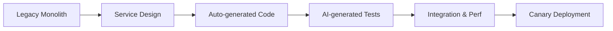
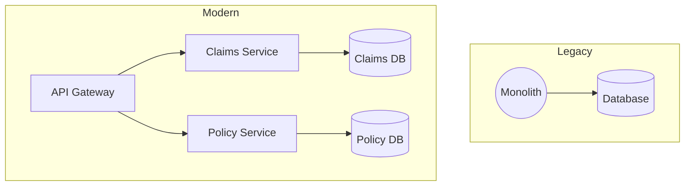

# Enterprise Modernization Case Study

> A mission-critical insurance claims platform was transformed using the HUG AI methodology, cutting an expected 30-month rewrite to 18 months and saving 40% in costs.

## Organization Snapshot

- **Industry**: Financial Services  
- **Teams**: 120+ developers across 8 squads  
- **Original Estimate**: 30 months, $20M  
- **Actual Delivery**: 18 months, $12M  
- **Technology Shift**: Java 6 Monolith → Spring Boot Microservices  
- **Scope**: End-to-end claims processing (50K+ claims/day, $2B/year)

## Business & Technical Context

> The 15-year-old monolith supported regulatory-critical workflows (SOX, GDPR) and demanded zero-downtime migration.

!!! warning "Technical Debt"
    - 2.5M+ LoC in a tightly coupled Java monolith
    - Java 6, deprecated libraries, fragile builds
    - Just 20% code documented, 20% test coverage
    - Average response: 15s; frequent timeouts

!!! warning "Business Risk"
    - Declining customer satisfaction due to slow processing
    - High operational & compliance exposure
    - Stalled innovation and rising maintenance costs

## HUG AI Implementation Strategy

### Phase 1: Discovery & Analysis (Months 1–3)

!!! note "Agents Deployed"
    - Requirements Analyzer Agent  
    - Architecture Agent  
    - Security Agent

Key outcomes:
- **Business Rule Mining**: Extracted 200+ rules from legacy code
- **Data & Integration Mapping**: Documented 35 external endpoints
- **Compliance Matrix**: Cataloged regulatory touchpoints

> **Deliverables**: Rule catalog, data flows, dependency diagrams, compliance report.

### Phase 2: Modern Architecture Design (Months 3–6)

!!! tip "Strangler Fig & DDD"
    Gradually replace monolith components with bounded-context microservices.

```yaml
architecture:
  style: microservices
  patterns:
    - event-driven
    - cqrs
    - api-gateway
  services:
    - claims-ingestion
    - claims-processing
    - policy-management
    - customer-service
    - payment-processing
  cross_cutting:
    auth: OAuth2/JWT
    monitoring: Prometheus+Grafana
    logging: ELK
    tracing: Jaeger
```

Benefits: independent scaling, clear boundaries, polyglot flexibility.

### Phase 3: Incremental Migration (Months 6–15)



Waves:
- **1–3**: Low-risk services (30% scope)
- **4–8**: Core business logic (50%)
- **9–12**: Integrations & data (20%)

Metrics:
- 450K+ lines generated, 4K tests, 95% coverage
- Manual review rate: 100%, acceptance: 85%

### Phase 4: Deployment & Optimization (Months 15–18)

```yaml
ci_cd:
  pipeline: blue-green_with_canary
  rollback: < 5m
  platform: Kubernetes (AWS)
  autoscaling: enabled
```

Continuous monitoring and automated health checks ensured zero-downtime cutover.

## Results & Impact

### Quantitative Gains

| Metric               | Before     | After        |
|----------------------|-----------:|-------------:|
| Analysis Time        | 100%       | 50%          |
| Dev Velocity         | baseline   | +40%         |
| Test Coverage        | 20%        | 95%          |
| Defect Rate          | baseline   | -30%         |
| Response Time        | 15s        | 200ms        |
| Throughput           | baseline   | 10×          |
| Uptime               | 95%        | 99.9%        |

### Business & Team Benefits

!!! success "Cost Savings"
    $8M saved (40% under budget)

!!! success "Customer Satisfaction"
    +85% improvement in claims satisfaction

!!! success "Team Productivity"
    +90% positive feedback on AI assistance

## Architectural Transformation



## Key Success Factors & Lessons

!!! note "What Worked"
    - Strangler Fig incremental migration
    - AI-driven analysis and test generation
    - Event-driven microservices design

!!! warning "Lessons Learned"
    - Invest early in deep legacy analysis
    - Pilot non-critical modules first
    - Expect hidden complexity in data and rules

## Recommendations

1. **Secure executive sponsorship**  
2. **Form cross-functional teams**  
3. **Start with AI-powered discovery**  
4. **Adopt risk-based migration waves**  
5. **Embed CI/CD & governance from day one**