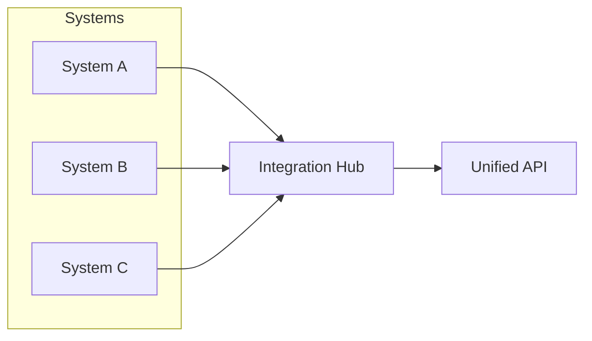

# Government Integration Case Study

> A national healthcare agency unified 12 disparate systems under a secure, compliant integration framework powered by HUG AI, delivering faster development and full auditability.

## Agency Profile

- **Sector**: Government Healthcare  
- **Teams**: 30 developers, 5 integration specialists  
- **Scope**: Integration of 12 legacy and modern healthcare applications

## Challenge

> The project demanded consistent data exchange across heterogeneous systems, rigorous compliance with government regulations, robust security, and zero disruption to live services.

!!! warning "Integration Complexity"
    - Multiple data models and formats (HL7, FHIR, proprietary APIs)
    - Diverse technologies (.NET, Java, ERP platforms)
    - Strict uptime requirements with no service interruptions
    - Regulatory mandates for data privacy, audit logging, and traceability

## HUG AI Implementation Strategy

### Phase 1: System Analysis & Mapping

!!! tip "AI-Powered Discovery"
    - Automated inspection of system interfaces and data schemas
    - Generation of unified field mappings and transformation rules
    - Identification of data inconsistencies and edge-case scenarios

```yaml
mappings:
  - source: patient_id
    target: patientIdentifier
    type: string
  - source: dob
    target: dateOfBirth
    type: date
  - source: visit_records
    target: clinicalVisits
    type: list
```

### Phase 2: Interface & Transformation Development

!!! note "API Specification"
    - AI-generated OpenAPI contracts for each integration endpoint
    - Template-based scaffolding for data transformation microservices
    - Built-in validation rules for schema enforcement

```json
{
  "paths": {
    "/patients/{id}": {
      "get": {
        "responses": {"200": {"description": "Patient data"}}
      }
    }
  }
}
```

### Phase 3: Security & Compliance

!!! warning "Regulatory Compliance"
    - Automated threat modeling and vulnerability scans
    - Enforcement of OAuth2/JWT authentication across services
    - Immutable audit trails capturing all data exchanges

```bash
audit-log --source systemA --target systemB --record all --output encrypted_log.json
```

### Phase 4: Testing & Validation

!!! info "Comprehensive Test Suites"
    - AI-generated integration, performance, and security tests
    - Scenario-based testing for critical data flows
    - Continuous validation in CI pipelines to prevent regressions



## Results & Impact

!!! success "Efficiency Gains"
    - 50% reduction in integration development time
    - 30% fewer post-deployment defects

!!! success "Compliance & Traceability"
    - 100% audit coverage for all transactions
    - Automated compliance verification with zero manual effort

## Key Learnings

1. **Start with AI-driven schema mapping** to uncover hidden inconsistencies early.  
2. **Leverage templated API contracts** for consistent endpoint design.  
3. **Embed security scanning** in every stage for proactive compliance.  
4. **Use AI-generated test suites** to validate complex integration scenarios repeatedly.