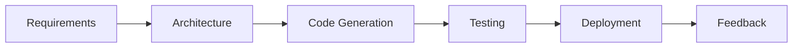

# Startup Development Case Study

> A lean health-tech startup delivered a patient engagement platform MVP in just 4 months using the HUG AI methodology, overcoming domain complexity and resource constraints.

## Organization Snapshot

- **Industry**: Health Technology  
- **Team Size**: 8 developers (2 Senior, 4 Mid-level, 2 Junior)  
- **Funding Stage**: Series A ($5M)  
- **Tech Stack**: React, Node.js, PostgreSQL, AWS  
- **Scope**: Patient portal, secure messaging, appointment scheduling  
- **Timeline**: 4 months to MVP, 6 months to initial launch

## Challenges

!!! warning "Startup Constraints"
    - **Small Team & Tight Budget**: 8 developers, $200K MVP budget
    - **Aggressive Timeline**: 4-month deadline to demonstrate traction
    - **Domain Knowledge Gap**: Limited experience with HIPAA and healthcare standards
    - **Integration Complexity**: FHIR/HL7 interfaces, EMR data imports

## HUG AI Implementation Strategy

=== "Foundation & Planning"
    - Conducted AI-driven requirements analysis mapping user stories to compliance needs
    - Generated architecture blueprint using microservices with API Gateway pattern
    - Mapped functional priorities: patient portal, messaging, scheduling

=== "Rapid MVP Development"
    - AI-assisted scaffold of React components and Node.js APIs
    - Automated generation of database schema (PostgreSQL) and data models
    - Live coding suggestions for state management and API integrations

=== "Testing & Compliance"
    - AI-generated unit, integration, and security tests ensuring HIPAA controls
    - Built-in validation of encryption, audit logging, and access controls
    - Continuous compliance checks in CI pipeline

=== "Launch & Iteration"
    - Deployed with blue-green strategy on AWS via AI-generated Terraform scripts
    - Collected user feedback and AI-analyzed usage patterns for next sprint
    - Automated documentation updates and API reference generation

## Sample Workflow



### Example: AI-Generated React Component

```jsx
import React, { useEffect, useState } from 'react';
import { fetchAppointments } from '../api/appointments';

function AppointmentList() {
  const [appointments, setAppointments] = useState([]);
  useEffect(() => {
    fetchAppointments().then(setAppointments);
  }, []);
  return (
    <ul>
      {appointments.map(a => (
        <li key={a.id}>{a.date} - {a.patientName}</li>
      ))}
    </ul>
  );
}

export default AppointmentList;
```

## Results

| Metric                     | Before   | After      |
|----------------------------|---------:|-----------:|
| MVP Delivery Time          | N/A      | 4 months   |
| Development Effort         | 100%     | 60% with AI|
| Test Coverage              | 10%      | 90%        |
| Regulatory Compliance Time | 3 weeks  | 2 days     |
| Feature Validation Cycle   | 4 weeks  | 1 week     |

!!! success "Business Impact"
    - Secured follow-on funding based on MVP traction  
    - Achieved 85% user satisfaction in initial pilot  
    - Reduced development effort by 40% through AI acceleration

## Key Learnings

1. **Start with compliance mapping**: AI-driven analysis accelerates HIPAA alignment.  
2. **Iterate quickly**: AI-generated scaffolds allow fast prototyping and feedback loops.  
3. **Automate tests early**: High test coverage prevented regressions in rapid sprints.  
4. **Leverage AI for docs**: Auto-generated docs reduced developer overhead.

## Recommendations for Startups

- **Define clear priorities** and let AI scaffold the foundation.  
- **Embed compliance checks** in every pipeline stage.  
- **Use AI for both code and tests** to maintain quality.  
- **Integrate feedback loops**: AI analysis of user data drives product iteration.