# HUG AI Development Flows

## Overview

HUG AI Development implements structured, traceable workflows where specialized AI agents collaborate through a well-defined Software Development Life Cycle. This approach ensures **human governance at every step** while maintaining development velocity and quality.

## Core Agent Flow

The default HUG AI development flow follows this agent orchestration pipeline:

```mermaid
graph LR
    A[Prompt Refiner] --> B[Requirements Analyzer]
    B --> C[Router] 
    C --> D[Architecture]
    D --> E[Implementation]
    E --> F[Testing]
    F --> G[Documentation]
    G --> H[Internal Reviewer]
    H --> I[Branch/PR Manager]
    I --> J[Maintenance]
    
    style A fill:#e1f5fe
    style D fill:#f3e5f5
    style E fill:#e8f5e8
    style F fill:#fff3e0
    style I fill:#c8e6c9
    style J fill:#ffebee
```



### Agent Responsibilities

| Agent | Phase | Core Function |
|-------|--------|---------------|
| **Prompt Refiner** | Planning | Clarifies requirements and optimizes task prompts |
| **Requirements Analyzer** | Planning | Comprehensive requirements engineering and analysis |
| **Router** | Planning | Intelligent workflow routing and agent orchestration |
| **Architecture** | Design | System design, architecture decisions, and blueprints |
| **Implementation** | Implementation | Universal code implementation across any tech stack |
| **Testing** | Testing | Comprehensive testing (unit, integration, e2e) |
| **Documentation** | Implementation | Technical and user documentation generation |
| **Internal Reviewer** | Testing | Code review, quality assessment, and improvements |
| **Branch/PR Manager** | Implementation | Git operations and version control management |
| **Maintenance** | Maintenance | Proactive maintenance and health monitoring |

### Specialized Agents

Additional agents can be integrated based on project needs:

- **Security Agent**: Security analysis and vulnerability assessment
- **Performance Agent**: Performance optimization and scalability analysis
- **Integration Agent**: API management and system integration
- **DevOps Agent**: Infrastructure automation and operational excellence
- **Retry Agent**: Intelligent failure analysis and task recovery

---

## Human Governance Checkpoints

### What are Checkpoints?

Checkpoints are strategic pause points in the development flow where AI agents **wait for human validation** before proceeding. This enables:

- **Interactive Learning**: Understand AI decision-making processes
- **Expert Guidance**: Inject human insight and domain expertise
- **Quality Control**: Prevent undesired outputs early in the process
- **Compliance Assurance**: Maintain regulatory and organizational requirements

### Checkpoint Configuration

Configure checkpoints using the `.hugai/flow.yaml` configuration:

```yaml
# .hugai/flow.yaml
project:
  name: "my-application"
  
governance:
  checkpoints:
    # Planning phase checkpoints
    after_requirements_analysis: true
    after_architecture_design: true
    
    # Implementation phase checkpoints
    after_code_implementation: false
    after_testing_completion: true
    
    # Review and deployment checkpoints
    after_code_review: true
    before_pr_creation: true
    before_deployment: true
    
  approval_workflows:
    requirements_changes:
      approvers: ["product-manager", "business-analyst"]
      timeout: "24h"
      
    architecture_changes:
      approvers: ["tech-lead", "principal-architect"]
      timeout: "48h"
      
    security_changes:
      approvers: ["security-lead", "ciso"]
      timeout: "72h"
      
    production_deployment:
      approvers: ["tech-lead", "devops-lead", "product-manager"]
      timeout: "24h"

# Team-specific configurations
team:
  experience_level: "intermediate"  # beginner, intermediate, advanced, expert
  governance_style: "balanced"      # minimal, balanced, strict
  automation_preference: "high"     # low, medium, high
```

### Dynamic Checkpoint Adaptation

HUG AI can automatically adjust checkpoints based on:

- **Team Experience**: More experienced teams get fewer checkpoints
- **Project Risk**: Higher risk projects require more governance
- **Change Impact**: Significant changes trigger additional checkpoints
- **Historical Performance**: Teams with good track records get more autonomy

---

## Workflow Patterns

### 1. Learning and Mentorship

**Use Case**: New team members learning AI-assisted development
**Checkpoints**: After every agent phase
**Benefits**: Deep understanding of AI decision-making

```yaml
governance:
  checkpoints:
    after_prompt_refinement: true
    after_requirements_analysis: true
    after_router_decision: true
    after_architecture_design: true
    after_code_implementation: true
    after_testing_completion: true
    after_documentation_creation: true
    after_code_review: true
    before_pr_creation: true
```

### 2. Enterprise and Regulated Teams

**Use Case**: Organizations with strict compliance requirements
**Checkpoints**: Key decision points and quality gates
**Benefits**: Regulatory compliance and risk management

```yaml
governance:
  checkpoints:
    after_requirements_analysis: true
    after_architecture_design: true
    after_testing_completion: true
    after_security_review: true
    before_pr_creation: true
    before_production_deployment: true
```

### 3. Fast Solo Development

**Use Case**: Experienced developers working on low-risk features
**Checkpoints**: Minimal governance, maximum velocity
**Benefits**: Speed and efficiency

```yaml
governance:
  checkpoints:
    before_pr_creation: true  # Only checkpoint before PR
```

### 4. Critical System Development

**Use Case**: Mission-critical applications requiring extensive oversight
**Checkpoints**: Comprehensive validation at all stages
**Benefits**: Maximum quality and reliability

```yaml
governance:
  checkpoints:
    after_requirements_analysis: true
    after_architecture_design: true
    after_code_implementation: true
    after_testing_completion: true
    after_security_review: true
    after_performance_validation: true
    after_code_review: true
    before_pr_creation: true
    before_deployment: true
    after_deployment: true
```

---

## Advanced Flow Control

### Conditional Workflows

```yaml
conditional_flows:
  high_risk_changes:
    conditions:
      - security_sensitive_files_modified: true
      - breaking_api_changes: true
      - database_schema_changes: true
    additional_checkpoints:
      - security_architect_review
      - database_administrator_review
      - api_compatibility_review
      
  performance_critical:
    conditions:
      - performance_sensitive_code: true
      - high_traffic_endpoints: true
    additional_agents:
      - performance_agent
      - load_testing_agent
    additional_checkpoints:
      - performance_benchmark_review
```

### Parallel Agent Execution

```yaml
parallel_execution:
  architecture_phase:
    parallel_agents:
      - architecture_agent
      - security_agent
      - performance_agent
    synchronization_point: "architecture_review_checkpoint"
    
  testing_phase:
    parallel_agents:
      - unit_test_agent
      - integration_test_agent
      - security_test_agent
    synchronization_point: "testing_completion_checkpoint"
```

### Rollback and Recovery

```yaml
rollback_policies:
  automatic_rollback:
    triggers:
      - test_failure_rate: "> 20%"
      - security_vulnerability: "critical"
      - performance_degradation: "> 50%"
    actions:
      - revert_to_last_checkpoint
      - notify_team_leads
      - trigger_retry_agent
      
  manual_rollback:
    authorized_users: ["tech-lead", "senior-developer"]
    rollback_points: ["any_checkpoint"]
    audit_required: true
```

---

## Flow Monitoring and Analytics

### Real-time Flow Tracking

```bash
# Monitor active flows
hugai flow status

# View detailed flow execution
hugai flow trace --task-id task-123

# Monitor checkpoint queue
hugai flow checkpoints --pending

# Flow performance analytics
hugai flow analytics --period 30d
```

### Flow Metrics

HUG AI tracks comprehensive metrics for flow optimization:

- **Flow Velocity**: Time between checkpoints and total flow duration
- **Checkpoint Efficiency**: Time spent in human review vs. AI execution
- **Quality Correlation**: Relationship between checkpoints and output quality
- **Team Productivity**: Impact of governance on overall team productivity

### Continuous Improvement

```yaml
flow_optimization:
  learning_enabled: true
  
  optimization_targets:
    - minimize_approval_time
    - maximize_quality_score
    - reduce_rework_cycles
    - improve_team_satisfaction
    
  feedback_integration:
    - checkpoint_effectiveness_feedback
    - agent_performance_feedback
    - team_workflow_satisfaction
    - quality_outcome_correlation
```

---

## Best Practices

### Checkpoint Design Principles

1. **Strategic Placement**: Position checkpoints at natural decision points
2. **Clear Context**: Provide sufficient information for human reviewers
3. **Actionable Options**: Enable clear approve/reject/modify decisions
4. **Time-bounded**: Set reasonable timeouts to prevent bottlenecks
5. **Escalation Paths**: Define clear escalation for timeout scenarios

### Team Adoption Guidelines

1. **Start Conservative**: Begin with more checkpoints and reduce gradually
2. **Team-specific**: Customize flows based on team experience and preferences
3. **Regular Review**: Periodically assess and optimize checkpoint effectiveness
4. **Metrics-driven**: Use flow analytics to guide optimization decisions
5. **Change Management**: Implement flow changes gradually with team input

### Governance Balance

- **Too Few Checkpoints**: Risk of AI errors and compliance issues
- **Too Many Checkpoints**: Reduced velocity and team frustration
- **Optimal Balance**: Checkpoints that add value without hindering productivity

---

## Integration Examples

### GitHub Integration

```yaml
github_integration:
  pr_creation:
    require_checkpoint_approval: true
    auto_assign_reviewers: true
    include_flow_summary: true
    
  status_checks:
    checkpoint_approval: "required"
    flow_completion: "required"
    quality_gates: "required"
```

### JIRA Integration

```yaml
jira_integration:
  ticket_updates:
    checkpoint_transitions: true
    approval_comments: true
    flow_progress_tracking: true
    
  workflow_mapping:
    "In Progress": "implementation_phase"
    "Code Review": "review_checkpoint"
    "Ready for Testing": "testing_phase"
    "Done": "flow_completed"
```

---

HUG AI Development Flows provide the framework for intelligent human-AI collaboration, ensuring that teams maintain control and oversight while benefiting from AI acceleration and automation.

*The key is finding the right balance of governance for your team's needs, project requirements, and organizational constraints.*