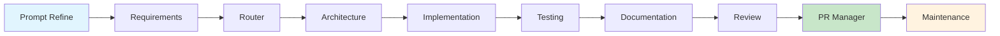

# What is HUG AI?

**HUG AI** stands for **Human-Governed AI Software Development** — a comprehensive methodology designed to integrate artificial intelligence tools into software development workflows while maintaining human control over decisions, architecture, quality, security, and responsibility.

## Core Philosophy

> "We don't automate developers — we multiply them."

The name "HUG" reflects our fundamental belief: AI doesn't replace developers — it **enhances** them. AI can generate code, but humans design it, review it, understand it, and make it trustworthy.

"HUG" also expresses our attitude toward AI:

- **We don't fear it** — we embrace it as a powerful development partner
- **We don't let it run alone** — we guide it with human oversight
- **We don't trust it blindly** — we audit and validate every output

## What Makes HUG AI Different?

### 🎯 **Human-Governed at Every Step**
- Humans guide and validate all AI output
- Critical decisions always require human approval
- Transparent audit trails for all AI actions
- Human expertise drives architectural and strategic decisions

### 🤖 **Multi-Agent Architecture**
- Each AI agent has a clear, specialized role
- Agents work collaboratively in structured workflows
- Modular design enables flexible team compositions
- Specialized expertise for different development phases

### 📋 **Modular and Auditable**
- Generated code is versionable and reviewable
- Complete traceability from requirement to deployment
- Git-based workflows with branch isolation
- Comprehensive documentation of all changes

### ⚡ **Productivity with Control**
- Accelerated development without sacrificing quality
- Automated routine tasks while preserving human judgment
- Scalable workflows that grow with team needs
- Governance-friendly with built-in compliance support

## Multi-Agent Development Team

HUG AI employs a team of specialized AI agents that work together through the complete development lifecycle:

| Agent | Phase | Specialization |
|-------|--------|----------------|
| **Prompt Refiner** | Planning | Improves task prompts, confirms scope and clarity |
| **Requirements Analyzer** | Planning | Comprehensive requirements engineering and analysis |
| **Router** | Planning | Intelligent workflow routing and agent orchestration |
| **Architecture** | Design | System design, architecture decisions, and blueprints |
| **Implementation** | Implementation | Universal code implementation across any tech stack |
| **Test** | Testing | Comprehensive testing (unit, integration, e2e) |
| **Documentation Writer** | Implementation | Technical and user documentation generation |
| **Branch/PR Manager** | Implementation | Git operations and version control management |
| **Internal Reviewer** | Testing | Code review, quality assessment, and improvements |
| **Retry** | Implementation | Intelligent failure analysis and task recovery |
| **Deployment** | Deployment | Universal deployment and infrastructure automation |
| **Maintenance** | Maintenance | Proactive maintenance and health monitoring |
| **Security** | Testing | Security analysis and vulnerability assessment |
| **Performance** | Testing | Performance optimization and scalability analysis |
| **Integration** | Implementation | API management and system integration |
| **DevOps** | Deployment | Infrastructure automation and operational excellence |

## Development Workflow

### Agent Orchestration Pipeline



### Task Isolation and Parallel Processing

- **Dedicated Git Branch**: Each task gets its own isolated branch
- **Independent AI Team**: Fresh agent team instance per task
- **Parallel Execution**: Multiple tasks handled concurrently
- **Clear Lifecycle**: Tracked from idea to production deployment

### Human Governance Checkpoints

- **Pull Request Reviews**: Primary governance checkpoint
- **Approval Workflows**: Human validation at critical decision points
- **Feedback Integration**: Continuous improvement through human input
- **Quality Gates**: Automated checks with human oversight

## Key Benefits

### 🚀 **For Development Teams**
- **3-5x Development Speed**: Automated code generation and testing
- **Consistent Quality**: Standardized patterns and best practices
- **Reduced Cognitive Load**: AI handles routine tasks
- **Enhanced Learning**: AI explains decisions and suggests improvements

### 🏢 **For Organizations**
- **Faster Time-to-Market**: Accelerated delivery cycles
- **Cost Efficiency**: Reduced development costs per feature
- **Risk Mitigation**: Human oversight prevents AI mistakes
- **Compliance Ready**: Built-in governance and audit capabilities

### 👥 **For Individual Developers**
- **Skill Amplification**: Junior developers produce senior-level output
- **Focus on High-Value Work**: More time for architecture and problem-solving
- **Continuous Learning**: AI mentors and teaches best practices
- **Career Growth**: Enhanced productivity and code quality

## What HUG AI Includes

### 📚 **Comprehensive Methodology**
- Full development lifecycle adapted for AI collaboration
- Structured workflows and agent coordination patterns
- Best practices for human-AI collaboration
- Quality assurance and governance frameworks

### 🛠️ **Practical Tools and Templates**
- Pre-configured agent setups for different project types
- Integration templates for popular development platforms
- Automated testing and deployment frameworks
- Monitoring and analytics dashboards

### 📖 **Implementation Guidance**
- Step-by-step setup and configuration guides
- Team training materials and best practices
- Troubleshooting and optimization strategies
- Community-driven patterns and solutions

### 🔒 **Enterprise-Ready Features**
- Security and compliance automation
- Audit trails and governance controls
- Role-based access and approval workflows
- Integration with enterprise development tools

## Who is HUG AI For?

### 🎯 **Primary Audiences**

**Tech Leads and Engineering Managers**
- Scaling teams with responsible AI integration
- Maintaining quality while increasing velocity
- Implementing governance and compliance requirements

**Development Teams**
- Developers curious about AI-assisted development
- Teams seeking to improve productivity and code quality
- Organizations adopting modern development practices

**Product and Business Teams**
- Product teams seeking speed without losing oversight
- Organizations with strict compliance requirements
- Companies looking to reduce development costs

### 📈 **Ideal Use Cases**

**Enterprise Applications**
- Large projects with modular architectures
- Projects requiring strict quality gates and compliance
- Systems needing comprehensive documentation and traceability

**Scaling Organizations**
- Teams seeking to scale output without scaling headcount
- Organizations adopting DevOps and automation practices
- Companies transitioning to AI-augmented development

**Complex Projects**
- Multi-technology stack applications
- Systems with extensive integration requirements
- Projects requiring high reliability and performance

## Getting Started

### 🚀 **Quick Start Options**

**For Individual Developers**
```bash
npx @hugai/cli init --template solo-dev
```

**For Small Teams**
```bash
npx @hugai/cli init --template small-team
```

**For Enterprise**
```bash
npx @hugai/cli init --template enterprise
```

### 📚 **Next Steps**

1. **Learn the Methodology**: Start with the [HUG AI Manifesto](manifesto.md)
2. **Understand the Process**: Explore [Development Flows](flows.md)
3. **See It in Action**: Check out our [Case Studies](../case-studies/overview.md)
4. **Get Practical**: Follow our [Implementation Guides](../guides/overview.md)

---

HUG AI represents the future of software development: intelligent automation guided by human wisdom, delivering better software faster while maintaining the quality, security, and governance standards that matter most.

*Ready to multiply your development team's capabilities? Let's get started.*


## Framework Components

The methodology consists of several interconnected components that work together to create a comprehensive AI-augmented development environment:

### 📚 **Explore the Framework**
1. **[HUG AI Manifesto](manifesto.md)**: Core principles and values
2. **[Development Methodology](methodology.md)**: Complete framework overview
3. **[Software Development Lifecycle](sdlc.md)**: AI-enhanced SDLC phases
4. **[Agile Practices](agile-practices.md)**: AI-enhanced agile methodologies
5. **[Governance & Compliance](governance.md)**: Oversight and compliance frameworks
6. **[Risk Management](risks.md)**: Risk identification and mitigation strategies
7. **[Development Flows](flows.md)**: Practical workflow implementations

### 🛠️ **Practical Implementation**
- **[Agent Documentation](../agents/overview.md)**: Specialized AI agents and their capabilities
- **[Implementation Guides](../guides/overview.md)**: Step-by-step implementation guidance
- **[Project Templates](../tools/templates.md)**: Ready-to-use project configurations
- **[Best Practices](../best-practices/overview.md)**: Proven patterns and approaches
- **[Case Studies](../case-studies/overview.md)**: Real-world implementation examples

---

The HUG AI Development Methodology provides a structured, proven approach to integrating AI into software development while maintaining the human judgment, oversight, and accountability essential for professional software delivery.

*Ready to transform your development process? Choose your methodology component and begin your HUG AI journey.*