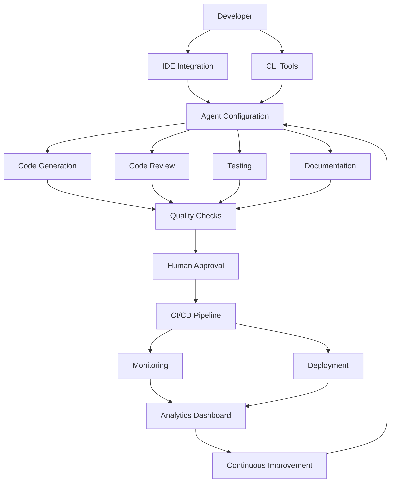

# Tools Overview

The HUG AI tools ecosystem provides a comprehensive suite of development tools, automation frameworks, and integration utilities that enable teams to implement human-governed AI development practices effectively across any technology stack.

## Tool Categories

### 🤖 **Agent Configuration & Management**
- **Agent Configuration**: Specialized AI agent setups for different development phases
- **Multi-Agent Orchestration**: Coordination and communication between agents
- **Context Management**: Project-specific knowledge base and context handling
- **Performance Optimization**: Resource allocation and caching strategies

### 🛠️ **Development & Integration Tools**
- **CLI & Automation**: Command-line tools and automation scripts
- **IDE Integrations**: VS Code, JetBrains, and other editor extensions
- **Development Workflow**: Local development and testing utilities
- **Code Quality Tools**: Linting, formatting, and analysis integrations

### 🏗️ **Infrastructure & Deployment**
- **CI/CD Integration**: GitHub Actions, GitLab CI, Jenkins pipelines
- **Deployment Automation**: Containerization and orchestration tools
- **Infrastructure as Code**: Terraform, CloudFormation, Kubernetes manifests
- **Environment Management**: Development, staging, production configurations

### 📊 **Monitoring & Analytics**
- **Performance Monitoring**: Agent efficiency and system performance tracking
- **Quality Metrics**: Code quality, test coverage, and defect tracking
- **Usage Analytics**: Team productivity and tool adoption insights
- **Governance Dashboards**: Human oversight and approval workflows

### 🎯 **Quality Assurance & Security**
- **Testing Frameworks**: Automated testing tools and strategies
- **Security Tools**: Vulnerability scanning and compliance validation
- **Code Review**: Automated and human review process tools
- **Documentation**: Auto-generation and maintenance tools

### 📋 **Configuration & Templates**
- **Project Templates**: Pre-configured starting points for different project types
- **Configuration Management**: Environment-specific settings and secrets
- **Implementation Strategies**: Scale-appropriate governance and workflow patterns
- **Best Practice Libraries**: Reusable patterns and configurations

## Core Principles

All HUG AI tools adhere to these fundamental principles:

### 🔍 **Transparency & Auditability**
- **Open Source**: All configurations and processes are fully inspectable
- **Audit Trails**: Complete logging of all AI actions and human decisions
- **Version Control**: All tools and configurations stored in source control
- **Documentation**: Comprehensive documentation for all tool functions

### 🔧 **Modularity & Composability**
- **Plugin Architecture**: Tools work independently and in combination
- **Human Checkpoints**: Natural integration points for human oversight
- **Technology Agnostic**: Works with any programming language or framework
- **Scalable Design**: Adapts from solo developers to enterprise teams

### 🚀 **Developer Experience**
- **Easy Installation**: Simple setup with minimal configuration
- **Intuitive Interface**: Clear, consistent command structures and APIs
- **Fast Feedback**: Real-time validation and immediate results
- **Learning Support**: Built-in help, examples, and best practice guidance

### 🏛️ **Enterprise Ready**
- **Security First**: Secure by default with enterprise-grade security features
- **Compliance Support**: Built-in support for GDPR, SOC2, HIPAA, and other standards
- **Scalability**: Handles projects from single developers to large enterprise teams
- **Integration Ready**: APIs and webhooks for custom integrations

## Getting Started

### 1. **Choose Your Entry Point**

**For Individual Developers:**
```bash
# Quick start with minimal configuration
npx @hugai/cli init --template solo-dev
```

**For Small Teams:**
```bash
# Team-oriented setup with basic governance
npx @hugai/cli init --template small-team
```

**For Enterprise:**
```bash
# Full enterprise governance and compliance
npx @hugai/cli init --template enterprise
```

### 2. **Install Core Tools**

```bash
# Install the HUG AI CLI
npm install -g @hugai/cli

# Install IDE extensions
hugai install vscode-extension
hugai install jetbrains-plugin

# Set up CI/CD integration
hugai setup cicd --provider github-actions
```

### 3. **Configure Your Project**

```bash
# Initialize HUG AI in your project
hugai init

# Configure agents for your technology stack
hugai configure agents --stack react,nodejs,postgresql

# Set up governance rules
hugai setup governance --level team
```

## Tool Integration Map



## Ecosystem Benefits

### **For Developers**
- **Productivity Boost**: 3-5x faster development with AI assistance
- **Quality Improvement**: Consistent code quality and fewer bugs
- **Learning Acceleration**: AI explains decisions and suggests improvements
- **Reduced Cognitive Load**: Automation handles routine tasks

### **For Teams**
- **Standardization**: Consistent practices across all team members
- **Knowledge Sharing**: AI captures and shares team knowledge
- **Risk Reduction**: Human oversight prevents AI mistakes
- **Velocity Increase**: Faster delivery without compromising quality

### **For Organizations**
- **Compliance Assurance**: Built-in governance and audit capabilities
- **Cost Efficiency**: Reduced development costs and faster time-to-market
- **Skill Amplification**: Junior developers produce senior-level output
- **Innovation Enablement**: Focus on high-value creative work

## Community & Ecosystem

### **Open Source Contributions**
The HUG AI tools ecosystem thrives on community contributions:

- **Tool Development**: Create new tools for specific use cases
- **Integration Libraries**: Build connectors for popular platforms
- **Template Creation**: Share project templates for different domains
- **Best Practice Documentation**: Document effective implementation patterns

### **Enterprise Extensions**
Enterprise-specific tools and integrations:

- **Custom Agent Training**: Fine-tune agents for organization-specific patterns
- **Advanced Analytics**: Detailed insights into development productivity
- **Compliance Automation**: Automated compliance checking and reporting
- **Custom Integrations**: Connect with enterprise systems and workflows

### **Partner Ecosystem**
Integrations with popular development tools:

- **Version Control**: GitHub, GitLab, Bitbucket, Azure DevOps
- **CI/CD Platforms**: Jenkins, CircleCI, Travis CI, Azure Pipelines
- **Cloud Providers**: AWS, Azure, Google Cloud, DigitalOcean
- **Monitoring Tools**: Datadog, New Relic, Prometheus, Grafana

## Next Steps

Explore specific tool categories based on your needs:

- **Getting Started**: [Project Templates](templates.md) and [Configuration Management](configuration.md)
- **Development**: [CLI Tools](cli-automation.md) and [IDE Integrations](ide-integrations.md) 
- **AI Configuration**: [Agent Setup](agents.md) and [Development Tools](development.md)
- **Operations**: [CI/CD Tools](cicd-tools.md) and [Deployment Tools](deployment-tools.md)
- **Monitoring**: [Quality Assurance](quality-assurance.md) and [Analytics](monitoring-analytics.md)

---

*The HUG AI tools ecosystem is continuously evolving. Join our community to contribute, share feedback, and help shape the future of human-governed AI development.*